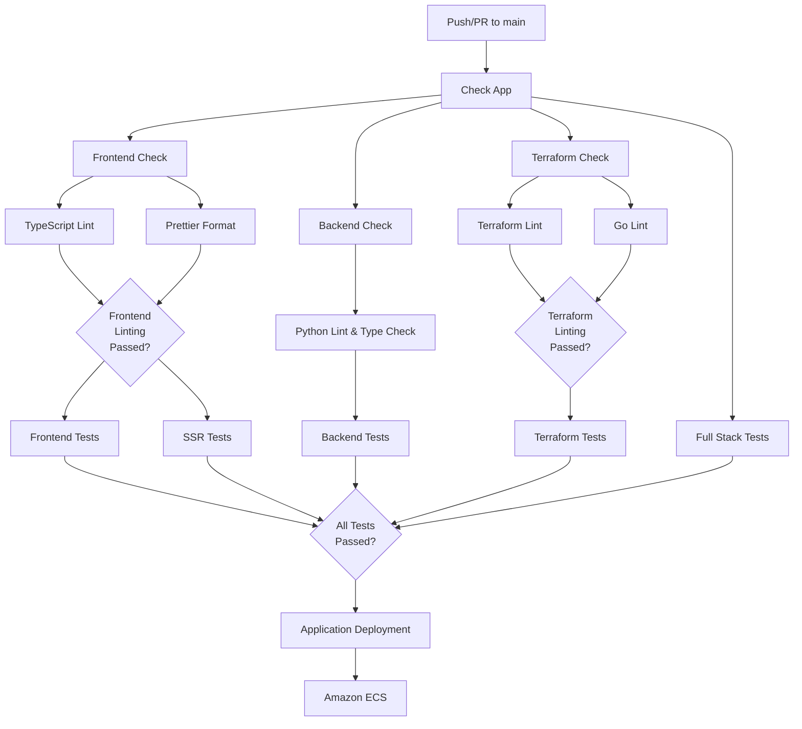

# GitHub Workflows

This directory contains the GitHub Actions workflows for the Coalition Builder project. These workflows automate
testing and other CI/CD processes.

## CI/CD Architecture

This project uses a structured CI/CD pipeline with the following key workflows:

### Figure 1: Main CI/CD Workflow

The following diagram shows the workflow orchestration from code push to deployment:

> **Note**: This diagram uses Mermaid syntax and will render automatically on GitHub and other platforms that support Mermaid. For detailed development documentation including this diagram, see the [Development Guide](https://lhadjchikh.github.io/coalition-builder/development/).

_Figure 1: Workflow dependency tree showing how push/PR events trigger orchestrated quality checks, linting, testing, and deployment processes. Diamond nodes represent quality gates where parallel processes must complete successfully before proceeding._

### Orchestration Workflows

#### Check App (`check_app.yml`)

- **Triggered by**: push to main, pull requests to main, or manual dispatch
- Centralized orchestration workflow that triggers relevant quality checks based on changed files
- Ensures linting runs before tests for faster failure detection
- Single source of truth for path-based quality check triggering

#### Backend Check (`check_backend.yml`)

- **Triggered by**: changes to Python files or workflow files
- Orchestrates backend-related workflows in the correct order:
  1. Runs Python linting and type checking (`lint_python.yml`) first
  2. Only after lint and type checks pass, runs Backend tests (`test_backend.yml`)

#### Frontend Check (`check_frontend.yml`)

- **Triggered by**: changes to frontend, shared, or SSR files, or workflow files
- Orchestrates frontend-related workflows in the correct order:
  1. Runs TypeScript linting (`lint_typescript.yml`) and Prettier formatting (`lint_prettier.yml`) in parallel
  2. Only after both lint checks pass, runs Frontend tests (`test_frontend.yml`) and SSR tests (`test_ssr.yml`)

#### Terraform Check (`check_terraform.yml`)

- **Triggered by**: changes to Terraform files, test files, or workflow files
- Orchestrates Terraform-related workflows in the correct order:
  1. Runs Terraform linting (`lint_terraform.yml`) and Go linting (`lint_go.yml`) in parallel
  2. Only after both lint checks pass, runs Terraform tests (`test_terraform.yml`)

### Code Quality and Linting Workflows

#### Python Linting (`lint_python.yml`)

- **Triggered by**: Backend Check workflow
- Runs Black code formatter, Ruff linter, and mypy type checker
- Ensures consistent Python code style and type safety
- mypy configured with gradual typing approach for existing codebase
- Ignores migrations, tests, and third-party modules with known issues

#### TypeScript Linting (`lint_typescript.yml`)

- **Triggered by**: Frontend Check workflow
- Runs ESLint and TypeScript compiler checks
- Validates TypeScript code quality and type safety

#### Prettier Formatting (`lint_prettier.yml`)

- **Triggered by**:
  - Frontend Check workflow (for frontend/shared/ssr files)
  - Direct triggers for files outside frontend domains (_.md, _.yml, _.yaml, _.json, \*.css, docs/**, .github/workflows/**)
- Runs Prettier for JavaScript, TypeScript, CSS, Markdown, YAML, and JSON files
- Ensures consistent formatting across all project files

#### Terraform Linting (`lint_terraform.yml`)

- **Triggered by**: Terraform Check workflow
- Runs `terraform fmt` and `tflint` for Terraform files
- Validates infrastructure code quality and formatting

#### Go Linting (`lint_go.yml`)

- **Triggered by**: Terraform Check workflow
- Runs various Go linters including `golangci-lint`, `staticcheck`, and `gosec`
- Ensures Go code quality in test modules

#### Shell Script Linting (`lint_shellcheck.yml`)

- **Triggered by**: changes to shell script files (no overlap with check workflows)
- Runs ShellCheck for shell script validation
- Ensures shell scripts follow best practices

### Test Workflows

#### Backend Tests (`test_backend.yml`)

- **Triggered by**: Backend Check workflow or manual dispatch
- Sets up Docker and PostgreSQL
- Runs the Django tests inside a Docker container
- Tests API endpoints, models, and business logic

#### Frontend Tests (`test_frontend.yml`)

- **Triggered by**: Frontend Check workflow or manual dispatch
- Installs dependencies with `npm ci`
- Runs unit and integration tests (excluding E2E tests)
- Builds the frontend application
- Checks for TypeScript errors (if applicable)

#### SSR Tests (`test_ssr.yml`)

- **Triggered by**: Frontend Check workflow or manual dispatch
- Runs unit tests for the Server-Side Rendering (SSR) Next.js application
- Tests SSR functionality and API integration
- Validates middleware and server-side rendering

#### Full Stack Integration Tests (`test_fullstack.yml`)

- **Triggered by**: Check App workflow (when any app code changes) or manual dispatch
- **Always runs on main branch pushes** to ensure integration integrity
- Focuses specifically on end-to-end tests that verify frontend and backend integration
- Starts the complete application stack in Docker
- Runs the E2E tests from the frontend against the live backend

#### Terraform Tests (`test_terraform.yml`)

- **Triggered by**: Terraform Check workflow or manual dispatch
- Validates Terraform configurations
- Runs comprehensive unit tests for all modules (networking, compute, security, database, monitoring, secrets, storage, dns, loadbalancer)
- Runs integration tests that validate complete configuration using plan-only validation
- **Cost-free testing**: All tests use plan-only validation - no AWS resources are created
- Generates test coverage reports for Terraform modules

**Test Types:**

- **Unit Tests**: Fast validation tests that check module file structure and configuration
- **Integration Tests**: Plan-only tests that validate complete terraform configuration with real AWS credentials but no resource creation

### Deployment Workflows

#### Application Deployment (`deploy_app.yml`)

- **Triggered by**: "Check App" workflow completion, "Terraform Infrastructure CI/CD" workflow completion, or manual dispatch
- Deploys the application to Amazon ECS when tests pass
- Can be manually triggered with an option to skip tests
- Builds and pushes Docker images to ECR with unique tags (SHA + run number)
- Updates ECS services with new task definitions
- Skips deployment when only documentation files are changed

#### Infrastructure Deployment (`deploy_infra.yml`)

- **Triggered by**: changes to `terraform/` directory on main branch or manual dispatch
- Manages AWS infrastructure changes using Terraform
- Runs independently of application code changes
- Includes Terraform planning and apply steps
- Manages AWS resources like VPC, ECS clusters, RDS, and load balancers
- **Triggers application deployment**: After successful infrastructure changes, automatically triggers app deployment to ensure compatibility with infrastructure

#### Documentation Deployment (`deploy_docs.yml`)

- **Triggered by**: changes to `docs/` directory or `mkdocs.yml` or manual dispatch
- Builds comprehensive documentation from multiple sources:
  - **API Documentation**: Generated from Django backend using Sphinx
  - **Frontend Documentation**: Generated from TypeScript/React code using TypeDoc
  - **User Guides**: Written in Markdown and processed by MkDocs
- Deploys to GitHub Pages automatically on main branch pushes
- Combines backend API docs, frontend component docs, and user documentation into a unified site

## Deployment Coordination

The deployment workflows coordinate to ensure smooth production updates:

### Scenarios Handled:

1. **Check App Completion**: When tests pass on main branch, application deployment proceeds automatically
2. **Infrastructure Deployment**: After infrastructure changes, application deployment is automatically triggered to ensure compatibility
3. **Documentation-Only Changes**: Deployments are skipped when only documentation files are modified

### Benefits:

- **Automated deployment**: Application deploys immediately when tests pass
- **Infrastructure compatibility**: App deployment follows infrastructure updates
- **Efficient resource usage**: Skips unnecessary deployments for documentation changes
- **Reliable process**: Consistent deployment trigger based on test success

## Manual Triggers

Workflows that interact with external resources support manual triggers via `workflow_dispatch`:

- **deploy_app.yml** - Deploys to AWS ECS
- **deploy_infra.yml** - Manages AWS infrastructure with Terraform
- **deploy_docs.yml** - Deploys to GitHub Pages

## AWS Credentials

The deployment and infrastructure workflows require AWS credentials to be configured as GitHub environment secrets:

- `AWS_ACCESS_KEY_ID`
- `AWS_SECRET_ACCESS_KEY`

These credentials should be configured in the GitHub "prod" environment and have the necessary permissions for ECR, ECS, and any other AWS services used in the application.

All production-related jobs have been configured to use the "prod" environment to access these secrets.

## Adding New Workflows

When adding new workflows, please follow these conventions:

1. Name your workflow file descriptively (e.g., `action_componentname.yml`)
2. Include clear step names and descriptions
3. Group related jobs logically
4. Add appropriate triggers and path filters
5. Include the workflow in this README with description
6. Follow security best practices (minimal permissions, environment restrictions)
7. Add manual trigger capability where appropriate (`workflow_dispatch`)
