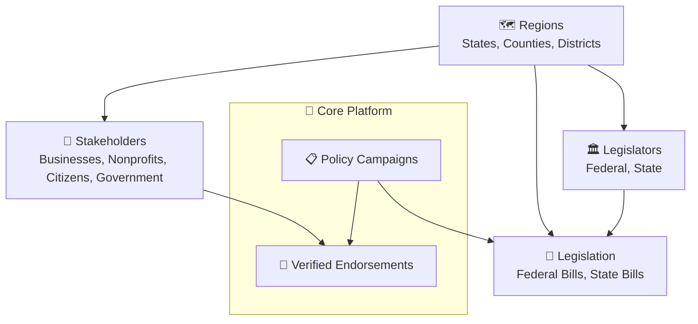

# Coalition Builder

[](https://lhadjchikh.github.io/coalition-builder/)
[](https://github.com/lhadjchikh/coalition-builder/actions/workflows/test_fullstack.yml)
[](https://codecov.io/gh/lhadjchikh/coalition-builder)

A comprehensive platform for organizing and managing policy advocacy campaigns, bringing together stakeholders, legislators, and advocates to drive meaningful policy change.

## 📊 Build Status

| Language       | Test Status                                                                                                                                                                                             | Code Coverage                                                                                                                                                                                 |
| -------------- | ------------------------------------------------------------------------------------------------------------------------------------------------------------------------------------------------------- | --------------------------------------------------------------------------------------------------------------------------------------------------------------------------------------------- |
| **Python**     | [](https://github.com/lhadjchikh/coalition-builder/actions/workflows/test_backend.yml)    | [](https://codecov.io/gh/lhadjchikh/coalition-builder)         |
| **TypeScript** | [](https://github.com/lhadjchikh/coalition-builder/actions/workflows/test_frontend.yml) | [](https://codecov.io/gh/lhadjchikh/coalition-builder) |
| **HCL**        | [](https://github.com/lhadjchikh/coalition-builder/actions/workflows/test_terraform.yml)    | N/A                                                                                                                                                                                           |

## 📋 Table of Contents

- [How Organizations Use Coalition Builder](#-how-organizations-use-coalition-builder)
  - [Core Components & Relationships](#core-components--relationships)
- [Features](#-features)
  - [Core Functionality](#core-functionality)
  - [Endorsement System](#endorsement-system)
- [Technology Stack](#️-technology-stack)
- [Documentation](#-documentation)
- [Quick Start](#-quick-start)
- [Contributing](#-contributing)
- [License](#-license)
- [Support](#-support)

## 📈 How Organizations Use Coalition Builder

Coalition Builder assists your organization through the complete advocacy process:

- **Create Campaign**: Launch policy initiatives around federal or state legislation
- **Recruit Stakeholders**: Identify and engage diverse supporters (businesses, nonprofits, citizens, government officials)
- **Collect Endorsements**: Secure verified support with built-in spam protection
- **Track Progress**: Analyze geographic distribution and engagement metrics
- **Engage Legislators**: Target representatives using district data
- **Drive Policy Change**: Export supporter data and coordinate strategic advocacy

### Core Components & Relationships

> **Note**: The Mermaid diagrams below are best viewed on GitHub or in the [online documentation](https://lhadjchikh.github.io/coalition-builder/).



## 🌟 Features

### Core Functionality

- **Dynamic Homepage Management** - Database-driven content with flexible blocks
- **Campaign Management** - Create and track policy advocacy campaigns at federal and state levels
- **Multi-Level Bill Tracking** - Support for both federal and state legislative bills
- **Stakeholder Management** - Organize supporters and endorsers with detailed profiles
- **Content Management** - Easy-to-use Django admin interface
- **API Integration** - RESTful API for custom integrations
- **SEO Optimized** - Server-side rendering with Next.js
- **Production Ready** - Secure AWS deployment with Terraform

### Endorsement System

- **🔐 Email Verification** - Secure token-based email verification for all endorsements
- **🛡️ Spam Prevention** - Multi-layer protection including rate limiting and content analysis
- **👨‍💼 Admin Review** - Comprehensive moderation workflow with bulk actions
- **📧 Automated Notifications** - Email workflows for verification, approval, and admin alerts
- **📊 Data Export** - CSV/JSON export capabilities with filtering options

## 🏗️ Technology Stack

- **Backend**: Django 5.2 + PostgreSQL + PostGIS
- **Frontend**: React 19 + TypeScript
- **SSR**: Next.js 15 (optional)
- **Infrastructure**: AWS + Terraform

## 📚 Documentation

**Complete documentation is available at: [lhadjchikh.github.io/coalition-builder](https://lhadjchikh.github.io/coalition-builder/)**

### Quick Links

- [📖 Installation Guide](https://lhadjchikh.github.io/coalition-builder/installation/) - Quick setup for development
- [🔧 Configuration](https://lhadjchikh.github.io/coalition-builder/configuration/) - Environment variables and settings
- [💻 Development Guide](https://lhadjchikh.github.io/coalition-builder/development/) - Development workflow
- [📡 API Reference](https://lhadjchikh.github.io/coalition-builder/api/) - Auto-generated API documentation
- [🚀 Deployment Guide](https://lhadjchikh.github.io/coalition-builder/deployment/) - Production deployment options

## 🚀 Quick Start

```bash
# Clone the repository
git clone https://github.com/lhadjchikh/coalition-builder.git
cd coalition-builder

# Start with Docker (recommended)
# For production/CI
docker compose up -d

# For local development with live code reload
docker compose -f docker-compose.yml -f docker-compose.dev.yml up -d

# Create test data
docker compose exec api python scripts/create_test_data.py

# Access the application
# Frontend: http://localhost:3000 (SSR)
# Frontend SPA: http://localhost:8000 (Django serves React)
# API: http://localhost:8000/api/
# Admin: http://localhost:8000/admin/
```

## 🤝 Contributing

We welcome contributions! Please see our [Contributing Guide](docs/development.md#contributing) for details.

## 📄 License

This project is licensed under the MIT License - see the [LICENSE](LICENSE) file for details.

## 🆘 Support

- 📖 [Documentation](https://lhadjchikh.github.io/coalition-builder/)
- 🐛 [Issue Tracker](https://github.com/lhadjchikh/coalition-builder/issues)
- 💬 [Discussions](https://github.com/lhadjchikh/coalition-builder/discussions)

---

Built with ❤️ to empower advocacy organizations and drive policy change.
