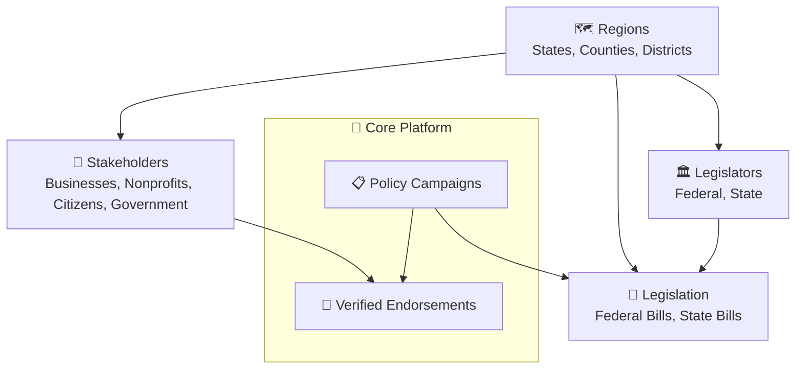
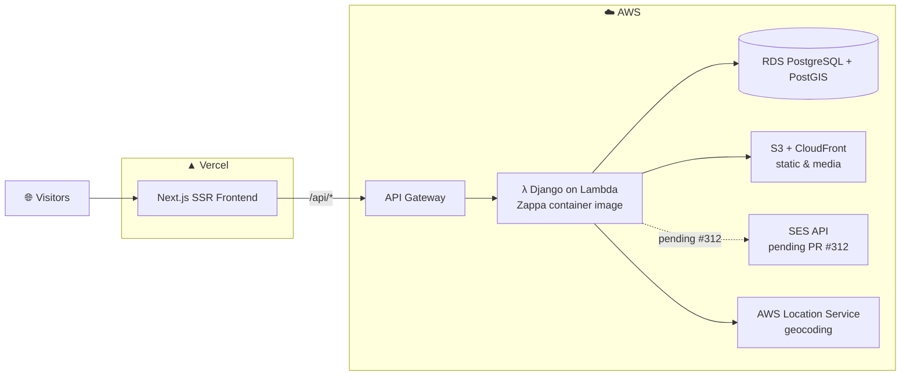

# Coalition Builder

[](https://lhadjchikh.github.io/coalition-builder/)
[](https://github.com/lhadjchikh/coalition-builder/actions/workflows/test_fullstack.yml)
[](https://codecov.io/gh/lhadjchikh/coalition-builder)

> **⚠️ Pre-Alpha Software:** This project is in pre-alpha and undergoing rapid development. No official releases yet. Expect frequent updates and architectural changes.
>
> The migration from ECS Fargate to a serverless architecture ([PR #222](https://github.com/lhadjchikh/coalition-builder/pull/222)) is **complete**. Production runs Django on AWS Lambda and Next.js on Vercel; the ECS-based deployment is deprecated.

A comprehensive platform for organizing and managing policy advocacy campaigns, bringing together stakeholders, legislators, and advocates to drive meaningful policy change.

## 📊 Build Status

| Language       | Test Status                                                                                                                                                                                             | Code Coverage                                                                                                                                                                                 |
| -------------- | ------------------------------------------------------------------------------------------------------------------------------------------------------------------------------------------------------- | --------------------------------------------------------------------------------------------------------------------------------------------------------------------------------------------- |
| **Python**     | [](https://github.com/lhadjchikh/coalition-builder/actions/workflows/test_backend.yml)    | [](https://codecov.io/gh/lhadjchikh/coalition-builder)         |
| **TypeScript** | [](https://github.com/lhadjchikh/coalition-builder/actions/workflows/test_frontend.yml) | [](https://codecov.io/gh/lhadjchikh/coalition-builder) |
| **HCL**        | [](https://github.com/lhadjchikh/coalition-builder/actions/workflows/test_terraform.yml)    | N/A                                                                                                                                                                                           |

## 📋 Table of Contents

- [How Organizations Use Coalition Builder](#-how-organizations-use-coalition-builder)
  - [Core Components & Relationships](#core-components--relationships)
- [Features](#-features)
  - [Core Functionality](#core-functionality)
  - [Endorsement System](#endorsement-system)
- [Technology Stack](#️-technology-stack)
- [Architecture](#-architecture)
- [Documentation](#-documentation)
- [Quick Start](#-quick-start)
- [Deployment](#-deployment)
- [Contributing](#-contributing)
- [License](#-license)
- [Support](#-support)

## 📈 How Organizations Use Coalition Builder

Coalition Builder assists your organization through the complete advocacy process:

- **Create Campaign**: Launch policy initiatives around federal or state legislation
- **Recruit Stakeholders**: Identify and engage diverse supporters (businesses, nonprofits, citizens, government officials)
- **Collect Endorsements**: Secure verified support with built-in spam protection
- **Track Progress**: Analyze geographic distribution and engagement metrics
- **Engage Legislators**: Target representatives using district data
- **Drive Policy Change**: Export supporter data and coordinate strategic advocacy

### Core Components & Relationships

> **Note**: This diagram uses Mermaid syntax and will render automatically on GitHub and other platforms that support Mermaid. For detailed documentation about how organizations use Coalition Builder, see the [Project Overview](https://lhadjchikh.github.io/coalition-builder/).


```mermaid
%%{init: {'theme':'basic'}}%%
flowchart TD
    Stakeholders[👥 Stakeholders<br/>Businesses, Nonprofits, Citizens, Government]
    Regions[🗺️ Regions<br/>States, Counties, Districts]
    Legislators[🏛️ Legislators<br/>Federal, State]

    subgraph Core["🎯 Core Platform"]
        Campaigns[📋 Policy Campaigns]
        Endorsements[📝 Verified Endorsements]
    end

    Legislation[📜 Legislation<br/>Federal Bills, State Bills]

    Stakeholders --> Endorsements
    Campaigns --> Endorsements
    Campaigns --> Legislation
    Regions --> Stakeholders
    Regions --> Legislators
    Regions --> Legislation
    Legislators --> Legislation
```

## 🌟 Features

### Core Functionality

- **Dynamic Homepage Management** - Database-driven content with flexible blocks
- **Campaign Management** - Create and track policy advocacy campaigns at federal and state levels
- **Multi-Level Bill Tracking** - Support for both federal and state legislative bills
- **Stakeholder Management** - Organize supporters and endorsers with detailed profiles
- **Legal Compliance** - GDPR-compliant cookie consent and comprehensive legal document management
- **Content Management** - Easy-to-use Django admin interface
- **API Integration** - RESTful API for custom integrations
- **SEO Optimized** - Server-side rendering with Next.js
- **Serverless Deployment** - Django on AWS Lambda and Next.js on Vercel, provisioned with Terraform

### Endorsement System

- **📋 Terms of Use Acceptance** - Required legal agreement with audit trail tracking
- **🔐 Email Verification** - Secure token-based email verification for all endorsements
- **🛡️ Spam Prevention** - Multi-layer protection including rate limiting and content analysis
- **👨‍💼 Admin Review** - Comprehensive moderation workflow with bulk actions
- **📧 Automated Notifications** - Email workflows for verification, approval, and admin alerts
- **📊 Data Export** - CSV/JSON export capabilities with filtering options

## 🏗️ Technology Stack

- **Backend**: Django 5.2 + Django Ninja on Python 3.13, running on AWS Lambda (packaged with Zappa as a container image)
- **Frontend**: Next.js 16 + React 19 + TypeScript (server-side rendered), deployed to Vercel
- **Database**: RDS PostgreSQL 16 with PostGIS, reached through private VPC subnets
- **Infrastructure**: Terraform-managed AWS (API Gateway, Lambda, RDS, S3, CloudFront, Secrets Manager, SES, AWS Location Service)
- **Local development**: Docker Compose (Django + Next.js + PostGIS)

## 🧭 Architecture

Production is fully serverless: API Gateway fronts a containerized Lambda running Django, and Vercel serves the Next.js frontend, proxying `/api/*` to the API. The repository contains ECS-based TIGER import scaffolding, but no current Terraform environment provisions it.


```mermaid
%%{init: {'theme':'basic'}}%%
flowchart LR
    User[🌐 Visitors]

    subgraph Vercel["▲ Vercel"]
        Next[Next.js SSR Frontend]
    end

    subgraph AWS["☁️ AWS"]
        APIGW[API Gateway]
        Lambda[λ Django on Lambda<br/>Zappa container image]
        RDS[(RDS PostgreSQL + PostGIS)]
        S3[S3 + CloudFront<br/>static & media]
        SES[SES API<br/>pending PR #312]
        Location[AWS Location Service<br/>geocoding]
    end

    User --> Next
    Next -->|/api/*| APIGW
    APIGW --> Lambda
    Lambda --> RDS
    Lambda --> S3
    Lambda -.->|pending #312| SES
    Lambda --> Location
```

Transactional email is currently blocked in Lambda. [PR #312](https://github.com/lhadjchikh/coalition-builder/pull/312) replaces the unreachable SMTP path with the SES API over a VPC endpoint.

There are no always-on application servers: no ALB, no ECS application service, and no NAT gateway. RDS and the EC2 bastion remain always-on resources, while Lambda reaches AWS services through VPC endpoints. Terraform is split into `shared` (VPC, RDS, bastion), `prod`, and `dev` environments, with GitHub Actions authenticating via OIDC.

For the resource inventory, IAM policies, and cost breakdown, see the [AWS Serverless Deployment guide](https://lhadjchikh.github.io/coalition-builder/deployment/aws/).

## 📚 Documentation

**Complete documentation is available at: [lhadjchikh.github.io/coalition-builder](https://lhadjchikh.github.io/coalition-builder/)**

### Quick Links

- [📖 Installation Guide](https://lhadjchikh.github.io/coalition-builder/installation/) - Quick setup for development
- [🔧 Configuration](https://lhadjchikh.github.io/coalition-builder/configuration/) - Environment variables and settings
- [💻 Development Guide](https://lhadjchikh.github.io/coalition-builder/development/) - Development workflow
- [📡 API Reference](https://lhadjchikh.github.io/coalition-builder/api/) - Auto-generated API documentation
- [🚀 Deployment Guide](https://lhadjchikh.github.io/coalition-builder/deployment/) - Serverless deployment overview
- [☁️ AWS Deployment](https://lhadjchikh.github.io/coalition-builder/deployment/aws/) - Full infrastructure walkthrough
- [λ Lambda Deployment](https://lhadjchikh.github.io/coalition-builder/LAMBDA_DEPLOYMENT/) - Django on Lambda
- [▲ Vercel Deployment](https://lhadjchikh.github.io/coalition-builder/VERCEL_DEPLOYMENT/) - Next.js on Vercel
- [🧰 Serverless Setup](https://lhadjchikh.github.io/coalition-builder/serverless-setup/) - Configure your own AWS resources

## 🚀 Quick Start

Local development runs the full stack in Docker — the serverless architecture applies to deployed environments only.

```bash
# Clone the repository
git clone https://github.com/lhadjchikh/coalition-builder.git
cd coalition-builder

# Start with Docker (recommended)
# For production-style builds / CI
docker compose up -d

# For local development with live code reload
docker compose -f docker-compose.yml -f docker-compose.dev.yml up -d

# Create test data
docker compose exec api python scripts/create_test_data.py

# Access the application
# Frontend: http://localhost:3000 (Next.js SSR)
# API: http://localhost:8000/api/
# Admin: http://localhost:8000/admin/
```

## 🚢 Deployment

Infrastructure is provisioned with Terraform; both applications deploy through GitHub Actions. Pushes to `main` deploy production, and pushes to `development` deploy the dev environment.

- [Deployment overview](https://lhadjchikh.github.io/coalition-builder/deployment/) - which pieces go where
- [AWS Serverless Deployment](https://lhadjchikh.github.io/coalition-builder/deployment/aws/) - resources, IAM, and costs
- [terraform/README.md](terraform/README.md) - multi-account bootstrap, OIDC, and module reference

## 🤝 Contributing

We welcome contributions! Please see our [Contributing Guide](docs/development.md#contributing) for details.

## 📄 License

This project is licensed under the MIT License - see the [LICENSE](LICENSE) file for details.

## 🆘 Support

- 📖 [Documentation](https://lhadjchikh.github.io/coalition-builder/)
- 🐛 [Issue Tracker](https://github.com/lhadjchikh/coalition-builder/issues)
- 💬 [Discussions](https://github.com/lhadjchikh/coalition-builder/discussions)

---

Built with ❤️ to empower advocacy organizations and drive policy change.

This project is tested with BrowserStack.
