# Endorsement System Workflow

This document illustrates the complete endorsement system workflow in Coalition Builder, from initial form submission through public display.

## Complete Endorsement Workflow

```mermaid
%%{init: {'theme':'basic'}}%%
flowchart TD
    %% User Journey
    A[User Loads Endorsement Form] --> B[User Fills Form Data]
    B --> C{Form Submission}

    %% Spam Prevention Layer
    C --> D[Rate Limiting Check]
    D --> E[Honeypot Field Validation]
    E --> F[Form Timing Analysis]
    F --> G[Email Reputation Check]
    G --> H[Content Quality Analysis]
    H --> I[IP Validation]

    %% Spam Detection Decision
    I --> J{Spam Detected?}
    J -->|Yes| K[❌ Block Submission]
    J -->|No| L[Process Stakeholder Data]

    %% Stakeholder Processing
    L --> M[Email-based Deduplication]
    M --> N{Stakeholder Exists?}
    N -->|Yes| O[Validate Data Match]
    N -->|No| P[Create New Stakeholder]
    O --> Q[HTML Sanitization]
    P --> R[Geocoding & District Assignment]
    R --> Q

    %% Endorsement Creation
    Q --> S[Create Endorsement Record]
    S --> T[Status: PENDING]
    T --> U[Generate Verification Token]
    U --> V[Send Verification Email]

    %% Email Verification Flow
    V --> W[User Receives Email]
    W --> X{User Clicks Link?}
    X -->|No| Y[Token Expires 24hrs]
    X -->|Yes| Z[Verify Token]

    Z --> AA{Token Valid?}
    AA -->|No| BB[❌ Invalid Token]
    AA -->|Yes| CC{Auto-Approval Enabled?}

    %% Status Transitions
    CC -->|Yes| DD[Status: APPROVED]
    CC -->|No| EE[Status: VERIFIED]

    DD --> FF[Send Approval Email]
    EE --> GG[Admin Review Queue]

    %% Admin Moderation
    GG --> HH{Admin Action}
    HH -->|Approve| II[Status: APPROVED]
    HH -->|Reject| JJ[Status: REJECTED]

    II --> KK[Send Approval Email]
    JJ --> LL[Send Rejection Email]

    %% Public Display
    FF --> MM[Public Display Check]
    KK --> MM
    MM --> NN{Display Criteria Met?}
    NN -->|Yes| OO[✅ Publicly Displayed]
    NN -->|No| PP[❌ Not Displayed]

    %% Error Paths
    K --> QQ[Show Error Message]
    BB --> RR[Show Verification Error]
    Y --> SS[Allow Resend Email]
    LL --> TT[Internal Record Only]

    %% Styling
    classDef pending fill:#ffeb3b,stroke:#f57f17,color:#000
    classDef verified fill:#2196f3,stroke:#0d47a1,color:#fff
    classDef approved fill:#4caf50,stroke:#1b5e20,color:#fff
    classDef rejected fill:#f44336,stroke:#b71c1c,color:#fff
    classDef error fill:#ff5722,stroke:#bf360c,color:#fff
    classDef process fill:#e3f2fd,stroke:#1976d2,color:#000

    class T,U,V pending
    class EE,GG verified
    class DD,II,FF,KK,OO approved
    class JJ,LL,PP,TT rejected
    class K,BB,QQ,RR error
    class D,E,F,G,H,I,L,M,Q,S process
```

## Workflow Phases

### 1. Form Submission & Spam Prevention

The endorsement process begins when a user submits the endorsement form. The system implements multiple layers of spam prevention:

- **Rate Limiting**: Maximum 3 attempts per 5 minutes per IP address
- **Honeypot Fields**: Hidden fields that bots typically fill out
- **Timing Analysis**: Forms submitted too quickly (< 5 seconds) or too slowly (> 30 minutes) are flagged
- **Email Validation**: Checks for disposable email services and deliverability
- **Content Analysis**: Integration with Akismet and custom pattern detection
- **IP Validation**: Protection against spoofing and known bad actors

### 2. Stakeholder Processing

Once spam checks pass, the system processes stakeholder data:

- **Email Deduplication**: Case-insensitive email matching to prevent duplicates
- **Data Validation**: For existing stakeholders, validates that provided data matches records
- **Geocoding**: New stakeholders get address geocoding and congressional district assignment
- **HTML Sanitization**: All text inputs are sanitized to prevent XSS attacks

### 3. Endorsement Creation

The endorsement record is created with:

- **Initial Status**: `pending` (requires email verification)
- **Unique Constraints**: One endorsement per stakeholder per campaign
- **Verification Token**: UUID token for email verification with 24-hour expiration
- **Metadata**: Form submission metadata for spam analysis

### 4. Email Verification

The verification process includes:

- **Verification Email**: Sent with unique link containing verification token
- **Token Validation**: Checks token validity and expiration
- **Status Transition**: `pending` → `verified` or `approved` (based on auto-approval setting)
- **Rate Limiting**: Prevents token brute-force attacks

### 5. Admin Moderation

Unless auto-approval is enabled, verified endorsements require admin review:

- **Review Queue**: Admin interface showing pending endorsements
- **Approval Actions**: Approve or reject with optional notes
- **Reviewer Tracking**: Records which admin reviewed the endorsement
- **Notification Emails**: Automatic emails sent on approval/rejection

### 6. Public Display

Endorsements are publicly displayed when they meet all criteria:

- `public_display = True` (user consent)
- `email_verified = True` (verified email)
- `status = "approved"` (admin approved)

## Status Definitions

| Status       | Description                           | Display               |
| ------------ | ------------------------------------- | --------------------- |
| **pending**  | Awaiting email verification           | ❌ Not displayed      |
| **verified** | Email verified, awaiting admin review | ❌ Not displayed      |
| **approved** | Admin approved for public display     | ✅ Publicly displayed |
| **rejected** | Admin rejected, with optional notes   | ❌ Not displayed      |

## API Endpoints

### Public Endpoints

- `POST /api/endorsements/` - Submit new endorsement
- `POST /api/endorsements/verify/{token}/` - Verify email
- `POST /api/endorsements/resend-verification/` - Resend verification email
- `GET /api/endorsements/` - List approved public endorsements

### Admin Endpoints (Staff Only)

- `POST /api/endorsements/admin/approve/{id}/` - Approve endorsement
- `POST /api/endorsements/admin/reject/{id}/` - Reject endorsement
- `GET /api/endorsements/admin/pending/` - List pending endorsements
- `GET /api/endorsements/export/csv/` - Export endorsements as CSV
- `GET /api/endorsements/export/json/` - Export endorsements as JSON

## Security Features

### Spam Prevention

- **Multi-layer Detection**: Combines multiple signals for spam scoring
- **Confidence Thresholds**: Configurable spam confidence levels
- **Pattern Recognition**: Custom regex patterns for common spam content
- **Behavioral Analysis**: Form interaction timing and patterns

### Data Protection

- **HTML Sanitization**: Prevents XSS attacks in user content
- **CSV Injection Protection**: Sanitizes data in exports
- **Rate Limiting**: Prevents abuse and brute-force attacks
- **Token Expiration**: Time-limited verification tokens
- **CSRF Protection**: Required for admin actions

### Privacy & Compliance

- **Email Verification**: Confirms stakeholder email ownership
- **Public Display Consent**: Users explicitly consent to public display
- **Data Minimization**: Only collects necessary information
- **Admin Audit Trail**: Tracks all moderation actions

## Configuration Options

### Auto-Approval

- **Enabled**: `pending` → `approved` on email verification
- **Disabled**: `pending` → `verified` → manual admin review required

### Spam Detection Sensitivity

- **Strict**: Higher spam detection, may have false positives
- **Balanced**: Default setting balancing security and usability
- **Permissive**: Lower detection, suitable for trusted audiences

### Email Settings

- **Verification Template**: Customizable email templates
- **Sender Configuration**: From address and reply-to settings
- **Delivery Tracking**: Optional integration with email services

This comprehensive workflow ensures that endorsements are authentic, verified, and appropriately moderated while maintaining user privacy and system security.
