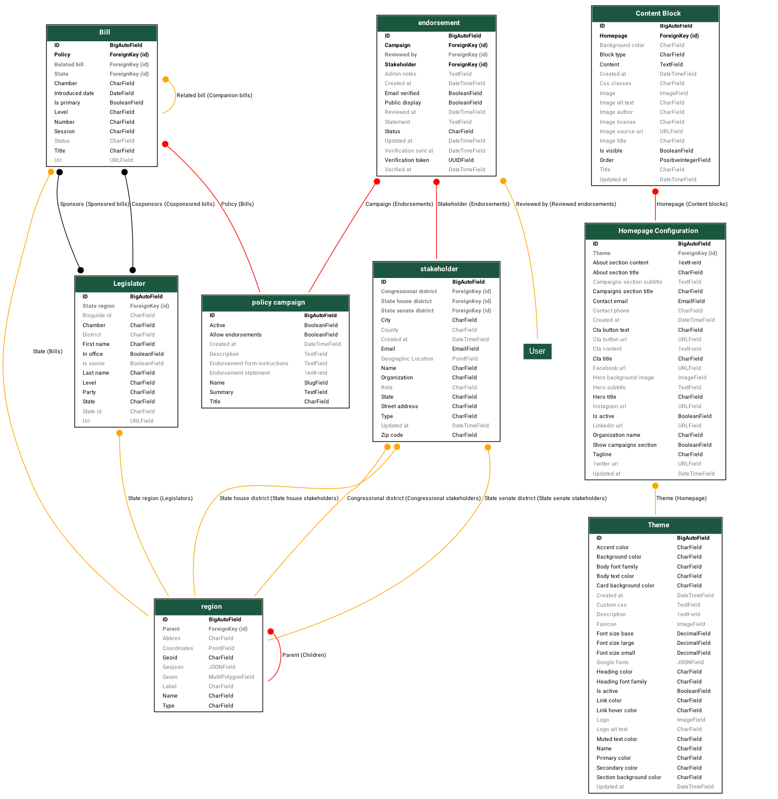

# Database Models

This document describes the database model structure for the Coalition Builder application.

## Model Overview

The Coalition Builder application uses Django models to represent the core entities:

- **Campaigns**: Policy initiatives that can receive endorsements
- **Stakeholders**: Individuals and organizations who can endorse campaigns
- **Legislators**: Elected officials who represent districts
- **Endorsements**: The relationship between stakeholders and campaigns
- **Regions**: Geographic boundaries for organizing stakeholders and legislators
- **Content**: Website content management (themes, homepage, content blocks)

## Model Diagrams

### Coalition Project Models



This diagram shows only the Coalition Builder project models, excluding Django built-in models and third-party dependencies for clarity. The diagram includes:

- **Policy Campaigns & Bills**: Campaign management with related legislation
- **Stakeholders**: Individuals and organizations with geographic data
- **Endorsements**: Relationships between stakeholders and campaigns
- **Legislators**: Elected officials with district assignments
- **Regions**: Geographic boundaries (states, districts, counties)
- **Content Management**: Themes, homepage configuration, and content blocks

## Key Relationships

### Campaign → Endorsement → Stakeholder

- Campaigns can have many endorsements
- Each endorsement links one stakeholder to one campaign
- Stakeholders can endorse multiple campaigns

### Stakeholder → Region

- Stakeholders belong to geographic regions
- Regions help organize stakeholders by location

### Legislator → Region

- Legislators represent specific districts/regions
- This enables targeting legislators based on stakeholder locations

### Content Management

- HomePage contains ContentBlocks for flexible page layout
- Theme defines the visual styling across the application
- Both support customization without code changes

## Model Details

### Campaign

- **Purpose**: Represents policy initiatives
- **Key Fields**: title, summary, description, endorsement settings
- **Relationships**: Has many endorsements

### Stakeholder

- **Purpose**: Individuals and organizations who can provide endorsements
- **Key Fields**: name, organization, email, type, location data
- **Relationships**: Belongs to region, has many endorsements

### Endorsement

- **Purpose**: Links stakeholders to campaigns they support
- **Key Fields**: statement, public_display flag
- **Relationships**: Belongs to campaign and stakeholder

### Legislator

- **Purpose**: Elected officials for targeting and reference
- **Key Fields**: name, chamber, party, district, contact info
- **Relationships**: Belongs to region

### Region

- **Purpose**: Geographic organization for stakeholders and legislators
- **Key Fields**: name, state, boundaries
- **Relationships**: Has many stakeholders and legislators

## Graph Generation

These diagrams are generated automatically using Django Extensions:

```bash
# Generate coalition project models only
poetry run python manage.py graph_models campaigns legislators stakeholders endorsements regions core \
  --output docs/architecture/models.png \
  --layout dot --theme django2018 --verbose-names --color-code-deletions --pydot

# Generate DOT file for programmatic access
poetry run python manage.py graph_models campaigns legislators stakeholders endorsements regions core \
  --output docs/architecture/models.dot \
  --dot --theme django2018 --verbose-names --color-code-deletions
```

The graphs use color coding for deletion relationships:

- **Red**: CASCADE (deleting parent deletes children)
- **Orange**: SET_NULL (deleting parent sets foreign key to null)
- **Green**: SET_DEFAULT (deleting parent sets foreign key to default)
- **Blue**: PROTECT (prevents deletion if children exist)
- **Grey**: DO_NOTHING (no automatic action)
