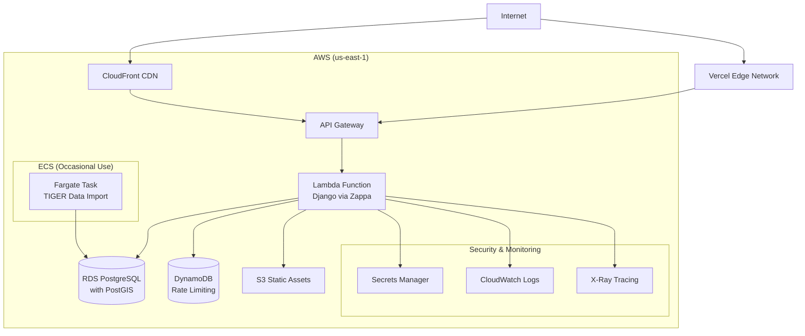

# AWS Serverless Deployment

## Overview

Coalition Builder uses a serverless architecture on AWS for cost-effective, scalable deployment. The application leverages Lambda for the Django backend and integrates with Vercel for the Next.js frontend.

## Architecture



## AWS Resources

### Core Infrastructure

#### Lambda Function

- **Runtime**: Python 3.13 on Docker
- **Memory**: 512MB (dev) to 1024MB (production)
- **Timeout**: 30 seconds
- **Keep-Warm**: Enabled for production (prevents cold starts)
- **VPC**: Optional (for RDS access)

#### API Gateway

- **Type**: REST API (for Django compatibility)
- **Custom Domain**: Optional via ACM certificate
- **Throttling**: Configured per environment
- **CORS**: Enabled for frontend integration

#### RDS PostgreSQL

- **Engine**: PostgreSQL 16 with PostGIS
- **Instance**: db.t3.micro (dev) to db.t3.small (production)
- **Storage**: 20GB GP3 with autoscaling
- **Multi-AZ**: Disabled (cost optimization)
- **Backup**: 7-day retention

#### DynamoDB

- **Billing**: Pay-per-request
- **Tables**: `coalition-builder-rate-limits`
- **TTL**: Enabled for automatic cleanup
- **Global Secondary Index**: None (simple key structure)

### Supporting Resources

#### S3 Buckets

- **Static Assets**: `coalition-builder-static`
- **Media Uploads**: `coalition-builder-media`
- **Zappa Deployments**: `coalition-builder-zappa-deployments`

#### ECS Fargate (TIGER Imports)

- **Cluster**: `coalition-builder-geodata-import`
- **Task Definition**: 2 vCPU, 4GB RAM
- **Usage**: Triggered manually for shapefile imports
- **Frequency**: Monthly or as needed

#### CloudWatch

- **Log Groups**: `/aws/lambda/{function-name}`
- **Metrics**: API Gateway, Lambda, DynamoDB
- **Retention**: 7 days (cost optimization)

#### Secrets Manager

- **Database URL**: RDS connection string
- **Django Secret Key**: Application secret
- **Rotation**: Disabled (manual)

## Infrastructure as Code

### Terraform Modules

```bash
terraform/
├── modules/
│   ├── dynamodb/          # Rate limiting tables
│   ├── zappa/             # S3 + IAM for Lambda
│   ├── geodata-import/    # ECS for TIGER imports
│   └── database/          # RDS PostgreSQL (existing)
```

### Deployment Commands

```bash
# Deploy core infrastructure
cd terraform
terraform init
terraform apply -target=module.database
terraform apply -target=module.dynamodb
terraform apply -target=module.zappa
terraform apply -target=module.geodata_import

# Deploy applications via GitHub Actions
gh workflow run deploy-lambda.yml --ref main
```

## Cost Analysis

### Monthly Costs (Approximate)

| Service       | Legacy ECS | Serverless      | Savings |
| ------------- | ---------- | --------------- | ------- |
| Compute       | ECS: $25   | Lambda: $5      | $20     |
| Load Balancer | ALB: $16   | API Gateway: $4 | $12     |
| Networking    | NAT: $32   | None: $0        | $32     |
| Database      | RDS: $15   | RDS: $15        | $0      |
| Storage       | S3: $5     | S3: $5          | $0      |
| Other         | $5         | DynamoDB: $1    | $4      |
| **Total**     | **$98**    | **$30**         | **$68** |

**Savings: 69% reduction**

### Cost Optimization Features

- **DynamoDB**: Pay-per-request (no idle costs)
- **Lambda**: Pay-per-invocation (no idle costs)
- **API Gateway**: Pay-per-request
- **ECS**: Only runs for TIGER imports (~$2/year)
- **No NAT Gateway**: Lambda doesn't need VPC for most operations

## Security

### IAM Roles & Policies

#### Lambda Execution Role

```json
{
  "Version": "2012-10-17",
  "Statement": [
    {
      "Effect": "Allow",
      "Action": [
        "logs:CreateLogGroup",
        "logs:CreateLogStream",
        "logs:PutLogEvents"
      ],
      "Resource": "arn:aws:logs:*:*:*"
    },
    {
      "Effect": "Allow",
      "Action": ["secretsmanager:GetSecretValue"],
      "Resource": "arn:aws:secretsmanager:*:*:secret:coalition-builder-*"
    },
    {
      "Effect": "Allow",
      "Action": ["dynamodb:Query", "dynamodb:PutItem", "dynamodb:GetItem"],
      "Resource": "arn:aws:dynamodb:*:*:table/coalition-builder-*"
    }
  ]
}
```

#### Zappa Deployment Role

- S3 access for deployment packages
- Lambda function management
- API Gateway configuration
- CloudWatch logs access

### Network Security

- **API Gateway**: DDoS protection included
- **Lambda**: No direct internet access (behind API Gateway)
- **RDS**: Private subnets with security groups
- **Secrets**: Encrypted at rest and in transit

## Monitoring & Alerts

### CloudWatch Metrics

#### Lambda Metrics

- Invocation count and duration
- Error rate and throttles
- Cold start frequency
- Memory utilization

#### API Gateway Metrics

- Request count and latency
- 4xx/5xx error rates
- Cache hit rates

#### DynamoDB Metrics

- Read/write capacity usage
- Throttling events
- Item count trends

### X-Ray Tracing

Enabled for production to track:

- Request flow across services
- Performance bottlenecks
- Error root cause analysis

### Alerting

```bash
# High error rate
aws cloudwatch put-metric-alarm \
  --alarm-name lambda-high-error-rate \
  --metric-name Errors \
  --namespace AWS/Lambda \
  --statistic Sum \
  --period 300 \
  --threshold 10 \
  --comparison-operator GreaterThanThreshold
```

## Deployment Environments

### Development

- Lambda: 512MB memory, no keep-warm
- API Gateway: Lower throttling limits
- RDS: Shared with staging
- DynamoDB: Shared table with environment prefix

### Staging

- Lambda: 512MB memory, 10-minute keep-warm
- API Gateway: Production-like throttling
- RDS: Shared with development
- DynamoDB: Shared table with environment prefix

### Production

- Lambda: 1024MB memory, 4-minute keep-warm
- API Gateway: Full throttling protection
- RDS: Dedicated instance
- DynamoDB: Dedicated table
- X-Ray: Enabled

## Backup & Disaster Recovery

### RDS Backups

- Automated backups: 7-day retention
- Point-in-time recovery: Enabled
- Cross-region snapshots: Optional

### Lambda Versioning

- Each deployment creates new version
- Rollback via Zappa: `zappa rollback prod -n 1`
- Code stored in S3 deployment bucket

### DynamoDB

- Point-in-time recovery: Enabled
- On-demand backups: Manual
- Global tables: Not needed (single region)

## Troubleshooting

### Common Issues

#### Lambda Cold Starts

```bash
# Check cold start metrics
aws logs filter-log-events \
  --log-group-name /aws/lambda/coalition-production \
  --filter-pattern "INIT_START"
```

**Solutions:**

- Increase memory allocation
- Enable keep-warm
- Use provisioned concurrency for critical functions

#### Database Connection Issues

```bash
# Check RDS connectivity
aws rds describe-db-instances --db-instance-identifier coalition-prod
```

**Solutions:**

- Verify security groups
- Check VPC configuration
- Review connection pooling settings

#### API Gateway Errors

```bash
# Check API Gateway logs
aws logs filter-log-events \
  --log-group-name API-Gateway-Execution-Logs_<api-id>/<stage>
```

**Solutions:**

- Review Lambda function logs
- Check API Gateway configuration
- Verify CORS settings

### Performance Tuning

#### Lambda Optimization

- Right-size memory allocation (affects CPU)
- Minimize cold start time
- Use connection pooling for RDS
- Optimize Docker image size

#### Database Optimization

- Enable query logging temporarily
- Add indexes for slow queries
- Consider read replicas for heavy read workloads
- Monitor connection counts

## Regional Considerations

### US East 1 (Primary)

- Lambda functions
- API Gateway
- RDS primary
- DynamoDB tables

### Vercel Edge Locations

- Global CDN automatically configured
- Edge functions for dynamic content
- Geographic routing optimization

This serverless architecture provides excellent performance with significant cost savings while maintaining the full feature set of the application.
