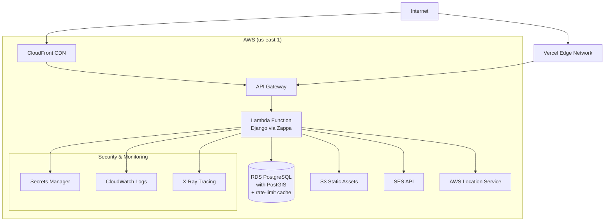

# AWS Serverless Deployment

## Overview

Coalition Builder uses a serverless architecture on AWS for cost-effective, scalable deployment. The application leverages Lambda for the Django backend and integrates with Vercel for the Next.js frontend.

## Architecture


```mermaid
%%{init: {'theme':'basic'}}%%
flowchart TB
    internet[Internet] --> cloudfront[CloudFront CDN]
    internet --> vercel[Vercel Edge Network]

    subgraph aws["AWS (us-east-1)"]
        cloudfront --> apigateway[API Gateway]
        apigateway --> lambda[Lambda Function<br/>Django via Zappa]

        lambda --> rds[(RDS PostgreSQL<br/>with PostGIS<br/>+ rate-limit cache)]
        lambda --> s3_static[S3 Static Assets]
        lambda --> ses[SES API]
        lambda --> geo[AWS Location Service]

        subgraph security["Security & Monitoring"]
            secrets[Secrets Manager]
            cloudwatch[CloudWatch Logs]
            xray[X-Ray Tracing]
        end

        lambda --> secrets
        lambda --> cloudwatch
        lambda --> xray
    end

    vercel --> apigateway
```

Lambda sends transactional email through the SES API over a private VPC endpoint and authenticates with its execution role; see [PR #312](https://github.com/lhadjchikh/coalition-builder/pull/312).

## AWS Resources

### Core Infrastructure

#### Lambda Function

- **Runtime**: Python 3.13 on Docker
- **Memory**: 512MB (dev) to 1024MB (production)
- **Timeout**: 30 seconds
- **Keep-Warm**: Enabled for production (prevents cold starts)
- **VPC**: Optional (for RDS access)

#### API Gateway

- **Type**: REST API (for Django compatibility)
- **Custom Domain**: Optional via ACM certificate
- **Throttling**: Configured per environment
- **CORS**: Enabled for frontend integration

#### RDS PostgreSQL

- **Engine**: PostgreSQL 16 with PostGIS
- **Instance**: One shared `db.t4g.micro` instance by default
- **Storage**: 20GB GP3 with autoscaling
- **Multi-AZ**: Disabled (cost optimization)
- **Backup**: 7-day retention

#### VPC Interface Endpoints

- **Production**: Secrets Manager, AWS Location (`geo.places`), and SES API (`email`)
- **Development, when enabled**: Secrets Manager and AWS Location (`geo.places`)
- **Placement**: Single AZ (`enable_single_az_endpoints`) to halve hourly cost
- **Purpose**: Let the Lambda in private subnets reach AWS services without a NAT gateway
- **CloudWatch Logs**: The per-account environments provision no Logs interface endpoint; Lambda delivers its own logs without one. The retained root configuration still uses the networking module's default Logs endpoint.
- **Cost**: $0.01/hour each — see [Cost Analysis](#cost-analysis). The July 2026 snapshot predates the Logs-to-SES endpoint swap in production and removal of the Logs endpoint in development.

#### Rate Limiting and State Locking

There is no application rate-limiting DynamoDB table. The bootstrap still creates DynamoDB tables for Terraform state locking. Application rate limiting uses the PostgreSQL-backed Django cache; see [Rate Limiting](../rate-limiting.md).

### Supporting Resources

#### S3 Buckets

- **Static Assets**: `coalition-builder-static`
- **Media Uploads**: `coalition-builder-media`
- **Zappa Deployments**: `coalition-builder-zappa-deployments`

#### TIGER Geodata Imports

The repository contains an ECS Fargate module and manual workflow for TIGER imports, but no current Terraform environment instantiates the module and no import cluster is provisioned. Treat the workflow as unavailable until an environment explicitly wires it in.

#### CloudWatch

- **Log Groups**: `/aws/lambda/{function-name}`
- **Metrics**: API Gateway, Lambda, RDS
- **Retention**: 7 days (cost optimization)

#### Secrets Manager

- **Database URL**: RDS connection string
- **Django Secret Key**: Application secret
- **Rotation**: Disabled (manual)

## Infrastructure as Code

### Terraform Modules

```text
terraform/
├── main.tf                  # Retained single-account root configuration
├── environments/
│   ├── shared/              # Database VPC, RDS, bastion
│   ├── prod/                # Production application VPC and services
│   └── dev/                 # Development application VPC and services
└── modules/
    ├── networking/        # VPC, subnets, VPC endpoints
    ├── database/          # RDS PostgreSQL with PostGIS
    ├── zappa/             # S3 + IAM for Lambda deployment
    ├── lambda-ecr/        # ECR repositories for Lambda images
    ├── aws-location/      # AWS Location Service place index
    ├── geodata-import/    # ECS for TIGER imports
    └── ...                # See terraform/README.md for the full list
```

### Deployment Commands

Deploy `shared` first — `prod` and `dev` read its VPC and RDS outputs via remote state. Complete the [multi-account bootstrap](multi-account-aws.md) and configure the required inputs before these commands. `setup_remote_state.sh` generates each environment's gitignored `backend.hcl`.

```bash
cd terraform/environments/shared
../../scripts/setup_remote_state.sh shared
terraform init -backend-config=backend.hcl
terraform plan -out=tfplan
terraform apply tfplan

cd ../prod
../../scripts/setup_remote_state.sh prod
terraform init -backend-config=backend.hcl
terraform plan -out=tfplan
terraform apply tfplan

# Deploy applications via GitHub Actions
gh workflow run deploy_lambda.yml --ref main -f environment=prod
```

## Cost Analysis

This is the authoritative cost reference; other pages link here rather than restating figures.

### Actual Monthly Costs

Measured from Cost Explorer (unblended) for July 2026, across all three accounts. Only lines above $0.01 are shown.

| Account    | Service                 | Monthly    |
| ---------- | ----------------------- | ---------- |
| **prod**   | VPC interface endpoints | $22.32     |
|            | WAF                     | $6.00      |
|            | Secrets Manager         | $1.61      |
|            | KMS                     | $1.00      |
|            | Route 53                | $0.50      |
|            | ECR                     | $0.46      |
|            | API Gateway             | $0.03      |
|            | _prod subtotal_         | _$31.92_   |
| **shared** | RDS PostgreSQL          | $16.04     |
|            | Public IPv4 addresses   | $3.72      |
|            | EC2 (bastion)           | $3.12      |
|            | KMS                     | $1.00      |
|            | EC2 - Other             | $0.64      |
|            | Route 53                | $0.51      |
|            | Secrets Manager         | $0.40      |
|            | _shared subtotal_       | _$25.44_   |
| **dev**    | VPC interface endpoints | $22.32     |
|            | Secrets Manager         | $1.20      |
|            | KMS                     | $1.00      |
|            | ECR                     | $0.15      |
|            | _dev subtotal_          | _$24.68_   |
| **Total**  |                         | **$82.04** |

Displayed rows are curated from Cost Explorer service and usage-type results rather than copied service labels. Account subtotals include sub-cent lines omitted by the `$0.01` display threshold and are rounded independently, so the visible shared and dev rows are each one cent below their subtotal.

Vercel is billed separately and is not included above.

#### Refreshing these figures

These are measured numbers, not estimates — regenerate them rather than adjusting them by hand. Costs are per-account, so query all three account profiles. Cost Explorer has a single `us-east-1` API endpoint, so keep the explicit region even if the profiles default elsewhere.

```bash
profiles=(your-prod-profile your-shared-profile your-dev-profile)

for profile in "${profiles[@]}"; do
  aws sso login --profile "$profile"

  echo "=== $profile: service totals ==="
  aws ce get-cost-and-usage --profile "$profile" --region us-east-1 \
    --time-period Start=2026-07-01,End=2026-08-01 \
    --granularity MONTHLY --metrics UnblendedCost \
    --group-by Type=DIMENSION,Key=SERVICE \
    --query 'ResultsByTime[].Groups[?to_number(Metrics.UnblendedCost.Amount) > `0.01`].[Keys[0],Metrics.UnblendedCost.Amount]' \
    --output text

  echo "=== $profile: EC2 usage types ==="
  aws ce get-cost-and-usage --profile "$profile" --region us-east-1 \
    --time-period Start=2026-07-01,End=2026-08-01 \
    --granularity MONTHLY --metrics UnblendedCost \
    --filter '{"Dimensions":{"Key":"SERVICE","Values":["EC2 - Other"]}}' \
    --group-by Type=DIMENSION,Key=USAGE_TYPE \
    --query 'ResultsByTime[].Groups[?to_number(Metrics.UnblendedCost.Amount) > `0.01`].[Keys[0],Metrics.UnblendedCost.Amount]' \
    --output text
done
```

Translate raw Cost Explorer rows into the display labels consistently:

| Display label           | Source                                                        |
| ----------------------- | ------------------------------------------------------------- |
| VPC interface endpoints | `EC2 - Other` usage type ending in `VpcEndpoint-Hours`        |
| Public IPv4 addresses   | `EC2 - Other` public-IPv4 usage types                         |
| EC2 (bastion)           | EC2 instance usage (`BoxUsage:*`)                             |
| EC2 - Other             | Remaining EC2 - Other total after the named usage types above |
| Other services          | Cost Explorer service name, shortened only for readability    |

For any surprising service total, repeat the second query with that exact service in the filter. Preserve the mapping table when adding or renaming a curated row.

### What actually drives the bill

- **VPC interface endpoints were the single largest July cost — $44.64/month across prod and dev**, more than RDS. During that snapshot each account ran three interface endpoints (Secrets Manager, CloudWatch Logs, and AWS Location `geo.places`) at $0.01/hour each. They are pinned to a single AZ (`enable_single_az_endpoints`), which already halves what multi-AZ would cost. The current configuration replaces the production Logs endpoint with SES and removes the development Logs endpoint, so a refreshed snapshot should show five endpoint-hours across the two accounts instead of six when development endpoints are enabled.
- **Compute is effectively free.** Lambda does not appear as a line item at all, and API Gateway costs $0.03/month at current traffic. The serverless migration did deliver on compute cost.
- **The dev account costs nearly as much as prod ($24.68 vs $31.92)** despite serving no traffic, because VPC endpoint hours accrue whether or not the Lambda is invoked.
- **No DynamoDB cost line appears above the reporting threshold.** The application code and settings — not the billing data — establish that rate limiting uses the PostgreSQL-backed Django cache. Terraform state-lock tables still exist.

### Cost reduction opportunities

- Disabling the two interface endpoints in the **dev** account saves about $15/month at $0.01/hour per endpoint. Dev would then need another route to Secrets Manager and AWS Location.
- The `geo.places` endpoint is only needed by code paths that geocode; dropping it where unused saves ~$7.44/month per account.
- WAF ($6.00/month, prod only) is a fixed web-ACL charge.

### Cost Optimization Features

- **Lambda**: Pay-per-invocation (no idle costs)
- **API Gateway**: Pay-per-request
- **ECS**: No current environment provisions the retained TIGER import scaffolding
- **Single-AZ VPC endpoints**: Half the cost of endpoints in every private subnet

## Security

### IAM Roles & Policies

#### Lambda Execution Role

```json
{
  "Version": "2012-10-17",
  "Statement": [
    {
      "Effect": "Allow",
      "Action": [
        "logs:CreateLogGroup",
        "logs:CreateLogStream",
        "logs:PutLogEvents"
      ],
      "Resource": "arn:aws:logs:*:*:*"
    },
    {
      "Effect": "Allow",
      "Action": ["secretsmanager:GetSecretValue"],
      "Resource": "arn:aws:secretsmanager:*:*:secret:coalition-builder-*"
    },
    {
      "Effect": "Allow",
      "Action": [
        "geo:SearchPlaceIndexForText",
        "geo:SearchPlaceIndexForPosition",
        "geo:SearchPlaceIndexForSuggestions",
        "geo:GetPlace"
      ],
      "Resource": "arn:aws:geo:*:*:place-index/coalition-*"
    },
    {
      "Effect": "Allow",
      "Action": ["ses:SendEmail", "ses:SendRawEmail"],
      "Resource": "*",
      "Condition": {
        "StringLike": {
          "ses:FromAddress": ["*@example.org", "noreply@example.org"]
        }
      }
    }
  ]
}
```

#### Zappa Deployment Role

- S3 access for deployment packages
- Lambda function management
- API Gateway configuration
- CloudWatch logs access

### Network Security

- **API Gateway**: DDoS protection included
- **Lambda**: No direct internet access (behind API Gateway)
- **RDS**: Private subnets with security groups
- **Secrets**: Encrypted at rest and in transit

## Monitoring & Alerts

### CloudWatch Metrics

#### Lambda Metrics

- Invocation count and duration
- Error rate and throttles
- Cold start frequency
- Memory utilization

#### API Gateway Metrics

- Request count and latency
- 4xx/5xx error rates
- Cache hit rates

#### RDS Metrics

- Connection count (Lambda concurrency can exhaust the connection limit)
- CPU and freeable memory
- Storage growth, including the `django_cache` rate-limit table

### X-Ray Tracing

Enabled for production to track:

- Request flow across services
- Performance bottlenecks
- Error root cause analysis

### Alerting

```bash
# High error rate
aws cloudwatch put-metric-alarm \
  --alarm-name lambda-high-error-rate \
  --metric-name Errors \
  --namespace AWS/Lambda \
  --statistic Sum \
  --period 300 \
  --threshold 10 \
  --comparison-operator GreaterThanThreshold
```

## Deployment Environments

Only `dev` and `prod` are provisioned. `zappa_settings.json.template` also defines a `staging` stage, but no Terraform environment or deployment workflow targets it.

### Development

- Lambda: 512MB memory, no keep-warm
- API Gateway: Lower throttling limits
- RDS: The Secrets Manager URL currently defaults to the shared instance's `coalition` database
- Rate limiting: `django_cache` table in the selected application database

### Production

- Lambda: 1024MB memory, 4-minute keep-warm
- API Gateway: Full throttling protection
- RDS: The Secrets Manager URL defaults to the shared instance's `coalition` database
- Rate limiting: `django_cache` table in the selected application database
- X-Ray: Enabled

## Backup & Disaster Recovery

### RDS Backups

- Automated backups: 7-day retention
- Point-in-time recovery: Enabled
- Cross-region snapshots: Optional

### Lambda Versioning

- Each deployment creates new version
- Rollback via Zappa: `zappa rollback prod -n 1`
- Code stored in S3 deployment bucket

### Rate-limit cache

No separate backup is needed. Rate-limit counters live in the `django_cache` table inside the application database and are covered by RDS backups; losing them only resets in-flight rate-limit windows.

## Troubleshooting

### Common Issues

#### Lambda Cold Starts

```bash
# Check cold start metrics
aws logs filter-log-events \
  --log-group-name /aws/lambda/coalition-production \
  --filter-pattern "INIT_START"
```

**Solutions:**

- Increase memory allocation
- Enable keep-warm
- Use provisioned concurrency for critical functions

#### Database Connection Issues

```bash
# Check RDS connectivity
aws rds describe-db-instances --db-instance-identifier coalition-prod
```

**Solutions:**

- Verify security groups
- Check VPC configuration
- Review connection pooling settings

#### API Gateway Errors

```bash
# Check API Gateway logs
aws logs filter-log-events \
  --log-group-name API-Gateway-Execution-Logs_<api-id>/<stage>
```

**Solutions:**

- Review Lambda function logs
- Check API Gateway configuration
- Verify CORS settings

### Performance Tuning

#### Lambda Optimization

- Right-size memory allocation (affects CPU)
- Minimize cold start time
- Use connection pooling for RDS
- Optimize Docker image size

#### Database Optimization

- Enable query logging temporarily
- Add indexes for slow queries
- Consider read replicas for heavy read workloads
- Monitor connection counts

## Regional Considerations

### US East 1 (Primary)

- Lambda functions
- API Gateway
- RDS primary
- VPC interface endpoints

### Vercel Edge Locations

- Global CDN automatically configured
- Edge functions for dynamic content
- Geographic routing optimization

This serverless architecture provides excellent performance with significant cost savings while maintaining the full feature set of the application.
