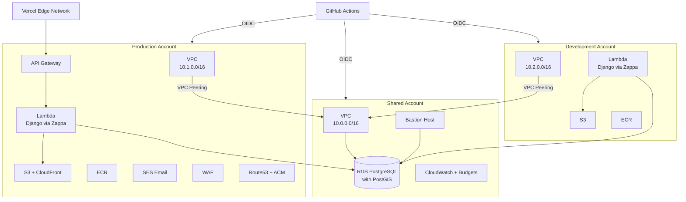
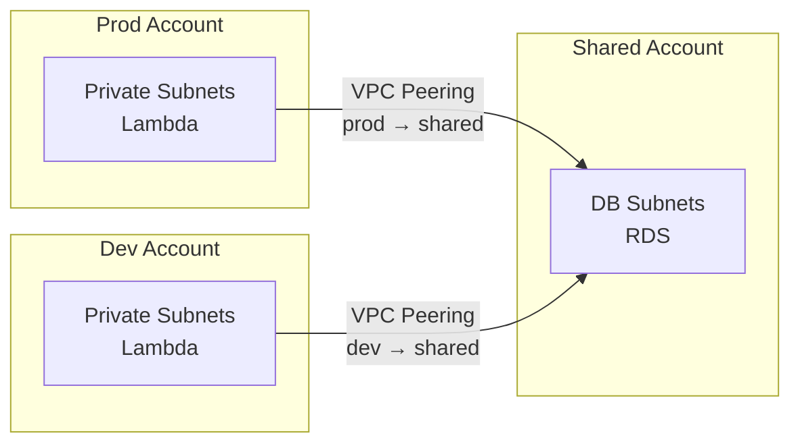

# Multi-Account AWS Infrastructure

This guide covers Coalition Builder's multi-account AWS architecture, how to bootstrap new accounts, and how to deploy infrastructure across environments.

## Architecture Overview

Coalition Builder uses three AWS accounts to separate concerns:



### Account Structure

| Account         | Contains                                                              | Purpose                                      |
| --------------- | --------------------------------------------------------------------- | -------------------------------------------- |
| **Shared**      | VPC, RDS PostgreSQL, Bastion, Monitoring                              | Centralized database and networking          |
| **Production**  | VPC, Lambda, API Gateway, S3, CloudFront, ECR, SES, WAF, Route53, ACM | Production application workloads             |
| **Development** | VPC, Lambda, S3, ECR                                                  | Development/testing (minimal infrastructure) |

### Key Design Decisions

- **Database in shared account**: Both prod and dev Lambda functions access the same RDS instance via VPC peering, avoiding duplicate database costs.
- **VPC peering for cross-account access**: Lambda functions in prod/dev connect to the shared account's database subnets through VPC peering connections.
- **OIDC authentication**: GitHub Actions authenticates to each AWS account via OIDC federation — no long-lived access keys.
- **Per-account Terraform state**: Each account has its own S3 state bucket and DynamoDB lock table. Prod/dev read the shared account's state via `terraform_remote_state` data sources.

## Prerequisites

Before bootstrapping, ensure you have:

1. **Three AWS accounts** with admin access to each
2. **AWS CLI** configured with profiles for each account (see example below)
3. **GitHub CLI** (`gh`) installed and authenticated
4. **Terraform** >= 1.12.0
5. **Domain** registered with Route53 (in the prod account)

```bash
# Example ~/.aws/config
[profile shared-admin]
region = us-east-1
# ... credentials or SSO config

[profile prod-admin]
region = us-east-1

[profile dev-admin]
region = us-east-1
```

## Bootstrap Process

The bootstrap scripts create the foundational resources that Terraform itself needs to run: S3 state buckets, DynamoDB lock tables, IAM OIDC providers, and cross-account roles.

### Quick Start: Bootstrap All Accounts

The `bootstrap_all.sh` orchestrator bootstraps all three accounts and configures GitHub in one command:

```bash
cd terraform/scripts/bootstrap

./bootstrap_all.sh \
  --shared-profile shared-admin \
  --prod-profile prod-admin \
  --dev-profile dev-admin \
  --github-org your-org \
  --github-repo coalition-builder
```

This runs four steps in order:

1. **Bootstrap prod** — creates S3 bucket, DynamoDB table, OIDC role
2. **Bootstrap dev** — same as prod
3. **Bootstrap shared** — same as above, plus a VPC peering accepter role (requires prod and dev account IDs from steps 1-2)
4. **Configure GitHub** — creates GitHub environments and sets OIDC role ARNs

### Bootstrap a Single Account

Use `bootstrap_account.sh` to bootstrap one account at a time:

```bash
# Prod or dev account
./bootstrap_account.sh \
  --environment prod \
  --github-org your-org \
  --github-repo coalition-builder \
  --profile prod-admin

# Shared account (requires prod and dev account IDs)
./bootstrap_account.sh \
  --environment shared \
  --github-org your-org \
  --github-repo coalition-builder \
  --profile shared-admin \
  --prod-account-id 111111111111 \
  --dev-account-id 222222222222
```

#### What Each Bootstrap Creates

| Resource                       | Description                                                              |
| ------------------------------ | ------------------------------------------------------------------------ |
| **S3 bucket**                  | `coalition-terraform-state-{account_id}` — versioned, encrypted, private |
| **DynamoDB table**             | `coalition-terraform-locks` — pay-per-request state locking              |
| **OIDC provider**              | GitHub Actions OIDC federation endpoint                                  |
| **IAM role**                   | `github-actions-{environment}` — assumable by GitHub Actions via OIDC    |
| **Peering role** (shared only) | `vpc-peering-accepter` — allows prod/dev to accept VPC peering           |

#### CloudFormation Parameters

The OIDC CloudFormation template (`github-oidc-role.cfn.yml`) accepts these parameters:

| Parameter         | Required | Default     | Description                                                                      |
| ----------------- | -------- | ----------- | -------------------------------------------------------------------------------- |
| `Environment`     | Yes      | —           | `shared`, `prod`, or `dev`                                                       |
| `GitHubOrg`       | Yes      | —           | GitHub org/user name                                                             |
| `GitHubRepo`      | Yes      | —           | GitHub repository name                                                           |
| `SharedAccountId` | No       | `""`        | Shared account ID for STS cross-account peering. Leave empty for shared account. |
| `ResourcePrefix`  | No       | `coalition` | Prefix for IAM resource ARN scoping                                              |

When `SharedAccountId` is empty, the STS statement is omitted. The bootstrap script does not pass `SharedAccountId` — cross-account STS permissions are applied when Terraform takes over management via import.

#### Per-Environment Terraform Configuration

After importing bootstrap resources, each environment's `github_oidc` module configures IAM scoping:

| Environment | `resource_prefix` | `peering_account_ids`     | STS Statement                                                      |
| ----------- | ----------------- | ------------------------- | ------------------------------------------------------------------ |
| **shared**  | `var.prefix`      | `[]`                      | Omitted (no cross-account peering)                                 |
| **prod**    | `var.prefix`      | `[var.shared_account_id]` | Allows `sts:AssumeRole` to shared account's `vpc-peering-accepter` |
| **dev**     | `var.prefix`      | `[var.shared_account_id]` | Same as prod                                                       |

### Configure GitHub Environments

If you used `--skip-github` with `bootstrap_all.sh`, or need to reconfigure GitHub environments:

```bash
./configure_github.sh \
  --repo your-org/coalition-builder \
  --shared-account-id SHARED_ID \
  --prod-account-id PROD_ID \
  --dev-account-id DEV_ID
```

This creates three GitHub environments (`shared`, `prod`, `dev`) with:

| Setting          | Type     | Value                             |
| ---------------- | -------- | --------------------------------- |
| `AWS_ACCOUNT_ID` | Variable | AWS account ID                    |
| `ENVIRONMENT`    | Variable | Environment name                  |
| `AWS_REGION`     | Variable | AWS region (default: `us-east-1`) |

### Import Bootstrap Resources into Terraform

After bootstrapping, import the CloudFormation-created OIDC resources into Terraform so they're managed going forward. The `bootstrap_all.sh` script prints the import commands:

```bash
# In terraform/environments/shared/:
terraform import module.github_oidc.aws_iam_openid_connect_provider.github[0] \
  arn:aws:iam::SHARED_ID:oidc-provider/token.actions.githubusercontent.com
terraform import module.github_oidc.aws_iam_role.github_actions github-actions-shared

# In terraform/environments/prod/:
terraform import module.github_oidc.aws_iam_openid_connect_provider.github[0] \
  arn:aws:iam::PROD_ID:oidc-provider/token.actions.githubusercontent.com
terraform import module.github_oidc.aws_iam_role.github_actions github-actions-prod

# In terraform/environments/dev/:
terraform import module.github_oidc.aws_iam_openid_connect_provider.github[0] \
  arn:aws:iam::DEV_ID:oidc-provider/token.actions.githubusercontent.com
terraform import module.github_oidc.aws_iam_role.github_actions github-actions-dev
```

## Terraform Environment Workflow

Each environment has its own Terraform root module under `terraform/environments/`:

```text
terraform/environments/
├── shared/          # Shared account resources
│   ├── main.tf
│   ├── variables.tf
│   ├── outputs.tf
│   ├── backend.tf
│   ├── backend.hcl
│   └── terraform.tfvars
├── prod/            # Production account resources
│   └── ...
└── dev/             # Development account resources
    └── ...
```

### Deploying an Environment

```bash
cd terraform/environments/prod

# Initialize with the environment's backend config
terraform init -backend-config=backend.hcl

# Plan and apply
terraform plan
terraform apply
```

### How State Isolation Works

Each environment stores its state in the account's own S3 bucket:

| Environment | S3 Bucket                                       | State Key                  |
| ----------- | ----------------------------------------------- | -------------------------- |
| shared      | `coalition-terraform-state-{shared_account_id}` | `shared/terraform.tfstate` |
| prod        | `coalition-terraform-state-{prod_account_id}`   | `prod/terraform.tfstate`   |
| dev         | `coalition-terraform-state-{dev_account_id}`    | `dev/terraform.tfstate`    |

Prod and dev environments read the shared account's state using a `terraform_remote_state` data source to get outputs like `vpc_id`, `database_endpoint`, and `db_subnet_cidrs`.

### Deployment Order

When deploying from scratch, apply environments in this order:

1. **shared** — creates VPC, RDS, bastion (no dependencies)
2. **prod** — depends on shared state for VPC peering and database endpoint
3. **dev** — depends on shared state for VPC peering and database endpoint

## VPC Peering

Cross-account networking uses VPC peering connections:



### How It Works

1. **Requester side** (prod/dev): The `vpc-peering` module creates a peering connection request from the environment's VPC to the shared VPC.
2. **Accepter side** (shared): The prod/dev Terraform assumes the `vpc-peering-accepter` role in the shared account to auto-accept the connection.
3. **Routes**: Both sides get route table entries so traffic flows between the private app subnets (prod/dev) and the database subnets (shared).

### VPC CIDR Ranges

The VPC CIDRs must not overlap:

| Account     | VPC CIDR      |
| ----------- | ------------- |
| Shared      | `10.0.0.0/16` |
| Production  | `10.1.0.0/16` |
| Development | `10.2.0.0/16` |

## OIDC Authentication

GitHub Actions authenticates to AWS using OpenID Connect (OIDC) federation instead of long-lived IAM access keys.

### How It Works

1. GitHub Actions requests a short-lived OIDC token from GitHub's token service
2. The workflow presents this token to AWS STS via `aws-actions/configure-aws-credentials`
3. AWS validates the token against the OIDC provider and checks the trust policy conditions
4. AWS issues temporary credentials scoped to the `github-actions-{environment}` role

### Trust Policy Conditions

Each environment's OIDC role restricts which GitHub contexts can assume it:

| Environment | Allowed Subjects                                                |
| ----------- | --------------------------------------------------------------- |
| **shared**  | `environment:shared`, `ref:refs/heads/main`                     |
| **prod**    | `environment:prod`, `ref:refs/heads/main`                       |
| **dev**     | `environment:dev`, `ref:refs/heads/development`, `pull_request` |

### Workflow Configuration

All deployment workflows use OIDC. The key configuration:

```yaml
permissions:
  contents: read
  id-token: write # Required for OIDC

steps:
  - name: Configure AWS credentials via OIDC
    uses: aws-actions/configure-aws-credentials@v4
    with:
      role-to-assume: arn:aws:iam::${{ vars.AWS_ACCOUNT_ID }}:role/github-actions-${{ env.ENVIRONMENT }}
      aws-region: us-east-1
```

No `AWS_ACCESS_KEY_ID` or `AWS_SECRET_ACCESS_KEY` secrets are needed.

### IAM Permission Scoping

The `github-actions-{environment}` role's infrastructure policy follows least-privilege scoping rather than granting `Resource: "*"` everywhere.

**Read-only access** — a combined `ServiceReadOnly` statement grants `Describe*`/`Get*`/`List*` at `Resource: "*"` for services whose list operations require it (EC2, CloudFront, WAF, SES, ACM, KMS, Geo, Budgets). This is safe since read-only actions have no side effects.

**IAM actions — split into read vs mutate:**

| Category      | Actions                                                                         | Resource Scope                                                                                                     |
| ------------- | ------------------------------------------------------------------------------- | ------------------------------------------------------------------------------------------------------------------ |
| **Read-only** | `Get*`, `List*`                                                                 | `*` (safe — no side effects)                                                                                       |
| **Mutate**    | `Create*`, `Delete*`, `Update*`, `Put*`, `Attach*`, `Detach*`, `PassRole`, etc. | `arn:aws:iam::{account_id}:role/{prefix}-*`, `policy/{prefix}-*`, `instance-profile/{prefix}-*`, `oidc-provider/*` |

The `resource_prefix` variable (default: `coalition`) controls the prefix pattern. This prevents the OIDC role from modifying IAM resources outside the project's namespace.

**EC2 — split into read vs mutate:**

| Category        | Actions                                  | Resource Scope                                                     |
| --------------- | ---------------------------------------- | ------------------------------------------------------------------ |
| **Read-only**   | `ec2:Describe*`, `ec2:Get*`, `ec2:List*` | `*` (some EC2 describe actions like `DescribeRegions` require `*`) |
| **All actions** | `ec2:*`                                  | `arn:aws:ec2:{region}:{account_id}:*`                              |

**Account-scoped services** — restricted to the current account using ARN patterns:

| Scope                                                  | Services                                                                              |
| ------------------------------------------------------ | ------------------------------------------------------------------------------------- |
| **Regional** (`arn:aws:<svc>:{region}:{account_id}:*`) | RDS, Lambda, ECR, Secrets Manager, SSM, SNS, CloudWatch/Logs, WAF, SES, ACM, KMS, Geo |
| **Global** (`arn:aws:<svc>::{account_id}:*`)           | CloudFront, Budgets                                                                   |

**Truly global services** — kept at `Resource: "*"` (no account ID in ARN):

- S3, Route53, API Gateway, Cost Explorer

**STS (cross-account peering)** — conditionally included:

- Prod/dev: `sts:AssumeRole` scoped to `arn:aws:iam::{shared_account_id}:role/vpc-peering-accepter`
- Shared: no STS statement (no cross-account role assumption needed)

The `peering_account_ids` variable controls which accounts appear in the STS statement. When empty, the STS statement is omitted entirely.

> **Note**: The bootstrap CloudFormation template creates the role without the STS statement (since `SharedAccountId` defaults to empty). The full policy — including account-scoped STS — is applied when Terraform takes over management via `terraform import` and `terraform apply`.

## CI/CD Workflows

Three workflows use the multi-account setup:

| Workflow              | File                    | Purpose                                                |
| --------------------- | ----------------------- | ------------------------------------------------------ |
| **Deploy to Lambda**  | `deploy_lambda.yml`     | Builds Docker image, pushes to ECR, deploys via Zappa  |
| **Deploy Serverless** | `deploy_serverless.yml` | Full-stack deploy (backend + frontend)                 |
| **Terraform CI/CD**   | `deploy_infra.yml`      | Plans and applies Terraform for a selected environment |

All three authenticate via OIDC and select the target environment based on branch or manual input. See [GitHub Workflows](workflows.md) for details.
