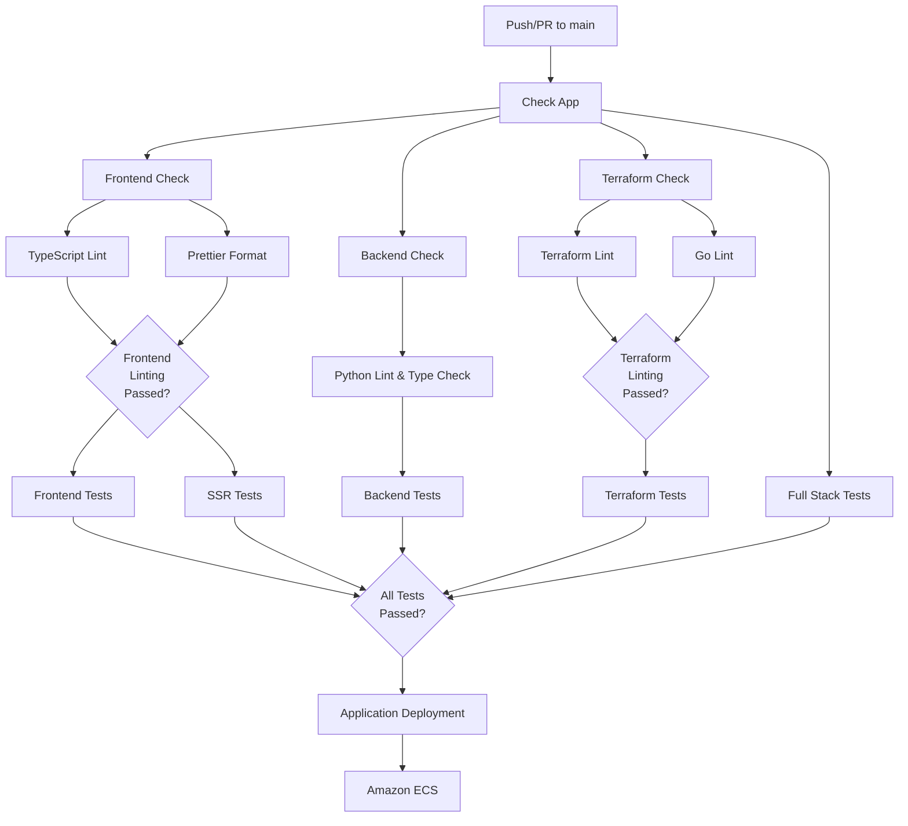

# Development Guide

This guide covers the development workflow, testing, and contributing to Coalition Builder.

## Development Workflow

### Quick Setup

For most developers, the [Installation guide](installation.md) provides everything needed. For detailed development environment setup including automated tooling installation, see the [Development Setup guide](development/setup.md).

### Docker Compose Configurations

Coalition Builder uses two Docker Compose configurations:

#### Production Configuration (`docker compose.yml`)

- **Purpose**: Production deployments and CI/CD pipelines
- **Features**: Optimized builds, production environment variables, no volume mounts
- **Usage**: `docker compose up -d`

#### Development Configuration (`docker compose.dev.yml`)

- **Purpose**: Local development with live code reload
- **Features**: Volume mounts for instant code changes, development build targets, debug mode
- **Usage**: `docker compose -f docker compose.yml -f docker compose.dev.yml up -d`

**Key Differences:**

- **Build Targets**: Production uses full builds, development uses `target: deps` for faster rebuilds
- **Volume Mounts**: Development mounts source code for live reload
- **Environment Variables**: `DEBUG=True` and `NODE_ENV=development` in dev mode
- **Commands**: Development uses `npm run dev` and `runserver`, production uses optimized startup commands

### Code Style

- Python: Black formatting, Ruff linting, mypy type checking
- TypeScript/React: Prettier formatting, ESLint
- Git: Conventional commit messages

### CI/CD Pipeline

The Coalition Builder project uses GitHub Actions for continuous integration and deployment. The workflow automatically tests all components and deploys to AWS on successful builds.

> **Note**: This diagram uses Mermaid syntax and will render automatically on GitHub and other platforms that support Mermaid.



The CI/CD pipeline includes:

- **Parallel Testing**: Frontend, backend, and infrastructure tests run simultaneously
- **Code Quality**: Automated linting and formatting checks
- **Full Stack Integration**: End-to-end testing across all components
- **Automated Deployment**: Successful builds deploy to AWS ECS

### Running Tests

```bash
# Backend tests
cd backend
poetry run pytest

# Frontend tests
cd frontend
npm test

# Backend tests
cd backend && poetry run pytest

# Frontend tests
cd frontend && npm test

# Infrastructure tests
cd terraform && go test ./tests/...
```

For comprehensive testing documentation, see the [Testing Guide](development/testing.md).

### Code Quality

```bash
# Run all linters
./scripts/lint.py
```

### Site Password Protection

Coalition Builder includes a flexible password protection system for securing your site during development and testing.

#### Architecture Overview

The system provides multiple protection layers:

**Development Options:**

- **SSR Container (Port 3000)**: Next.js middleware with HTTP Basic Authentication
- **nginx Proxy (Port 80)**: Optional reverse proxy with HTTP Basic Authentication
- **API Container (Port 8000)**: django-lockdown middleware with session-based authentication

**Production:**

- **ALB → SSR**: Next.js middleware protects frontend routes
- **ALB → API**: django-lockdown middleware protects API endpoints

#### Quick Start

Enable password protection by setting environment variables in your `.env` file:

```bash
# Enable password protection
SITE_PASSWORD_ENABLED=true
SITE_USERNAME=admin
SITE_PASSWORD=your-secure-password

# Restart containers
docker compose up -d
```

#### Access Options

```bash
# Direct SSR access with Next.js middleware protection
http://localhost:3000

# Through nginx proxy (if enabled)
http://localhost:80

# Direct API access with Django middleware protection
http://localhost:8000
```

#### Environment Variables

| Variable                | Description              | Default    | Used By        |
| ----------------------- | ------------------------ | ---------- | -------------- |
| `SITE_PASSWORD_ENABLED` | Enable protection        | `false`    | All containers |
| `SITE_USERNAME`         | HTTP Basic Auth username | `admin`    | SSR, nginx     |
| `SITE_PASSWORD`         | Site access password     | `changeme` | All containers |

#### Production Management

Set these GitHub repository secrets for production deployment:

- `SITE_PASSWORD_ENABLED`: `true` or `false`
- `SITE_USERNAME`: Username for authentication
- `SITE_PASSWORD`: Secure password

Changes apply automatically when infrastructure is deployed via the `deploy_infra.yml` workflow.

For detailed production setup, see the [Site Password Protection Guide](development/automated-protection.md).

## Project Structure

```
coalition-builder/
├── backend/           # Django API
│   ├── coalition/     # Main app
│   ├── docs/          # Sphinx API docs
│   └── scripts/       # Backend scripts
├── frontend/          # React frontend
├── ssr/               # Next.js SSR
├── terraform/         # Infrastructure
└── docs/              # Main documentation
```

## Key Technologies

- **Backend**: Django 5.2, Django Ninja, PostGIS
- **Frontend**: React 19, TypeScript, Tailwind CSS
- **Database**: PostgreSQL with PostGIS extension
- **Infrastructure**: AWS, Terraform
- **Documentation**: Sphinx, TypeDoc, MkDocs

## Contributing

1. Fork the repository
2. Create a feature branch
3. Write tests for your changes
4. Ensure all tests pass
5. Submit a pull request

### Code Guidelines

- Write meaningful commit messages
- Add tests for new features
- Update documentation as needed
- Follow existing code patterns

## API Development

The API is automatically documented from code. When adding new endpoints:

1. Use proper type hints
2. Add docstrings to views and models
3. Update API tests
4. Regenerate documentation

## Data Models

Key models include:

- **Bill**: Tracks federal and state legislative bills with chamber-specific formatting
- **Legislator**: Manages federal and state legislators with appropriate validation
- **PolicyCampaign**: Organizes advocacy campaigns with endorsement support
- **Stakeholder**: Stores supporter information with geographic data
- **Endorsement**: Handles campaign endorsements with verification workflow
- **Theme**: Manages visual branding and customization settings

## Theme System Development

Coalition Builder includes a comprehensive theme system for visual customization:

### Architecture

- **Backend**: Django model with color validation and CSS generation
- **Frontend**: Styled-components with theme provider for React components
- **SSR**: Full theme support in Next.js server-side rendering
- **API**: REST endpoints for programmatic theme management

### Key Components

#### Backend (`/backend/coalition/core/`)

- `models.py`: Theme model with hex color validation
- `theme_service.py`: CSS variable generation service
- `/api/themes.py`: Theme management API endpoints

#### Frontend (`/frontend/`)

- `contexts/ThemeContext.tsx`: React context for theme data
- `contexts/StyledThemeProvider.tsx`: Styled-components theme provider
- `styles/theme.ts`: Theme type definitions and utilities
- `components/`: React components with theme support
- `app/`: Next.js app router pages
- `services/`: API client and service layer
- `types/`: TypeScript type definitions

### Development Guidelines

#### Adding Styled Components

```typescript
import styled from "styled-components";

const MyComponent = styled.div<{ variant?: "primary" | "secondary" }>`
  background-color: ${(props) =>
    props.variant === "secondary"
      ? props.theme.colors.secondary
      : props.theme.colors.primary};
  color: ${(props) => props.theme.colors.white};
  padding: ${(props) => props.theme.spacing[4]};
  border-radius: ${(props) => props.theme.radii.md};
`;
```

#### Using Theme Context

```typescript
import { useTheme } from '../contexts/ThemeContext';

const MyComponent = () => {
  const { theme, loading } = useTheme();

  if (loading) return <div>Loading theme...</div>;

  return (
    <div style={{ color: theme?.primary_color }}>
      Themed content
    </div>
  );
};
```

#### API Integration

```typescript
// Fetch active theme
const response = await fetch("/api/theme/active/");
const theme = await response.json();

// Update theme
const updatedTheme = await fetch(`/api/theme/${id}/`, {
  method: "PUT",
  headers: { "Content-Type": "application/json" },
  body: JSON.stringify(themeData),
});
```

### Testing Themes

#### Backend Tests

- Model validation (hex colors, required fields)
- CSS generation functionality
- API endpoint responses

#### Frontend Tests

- Theme provider functionality
- Component rendering with different themes
- API integration tests

#### Integration Tests

- End-to-end theme switching
- SSR theme rendering
- CSS variable generation

## Component Development

### Shared Component Architecture

Coalition Builder uses a shared component architecture where:

- **Components**: All React components live in `/frontend/src/components/`
- **Types**: Shared TypeScript interfaces are in `/frontend/src/types/`
- **SSR Integration**: Next.js imports components from `/frontend` using `@frontend` aliases
- **Testing**: Unit tests are in `/frontend/src/components/__tests__/`

### Guidelines for React Components

1. **Create components in `/frontend/src/components/`** - they'll be used by both SPA and SSR
2. **Use TypeScript interfaces** from `/frontend/src/types/`
3. **Add JSDoc comments** for better documentation
4. **Write Jest unit tests** in `__tests__/` subdirectories
5. **Export types for reuse** across both frontend and SSR
6. **Handle errors gracefully** with fallback UI and user-friendly messages

### Error Handling Pattern

When creating components that fetch data:

```typescript
// Use Promise.allSettled for parallel API calls
const [dataResult, otherResult] = await Promise.allSettled([
  API.getData(),
  API.getOtherData(),
]);

// Handle each result separately
if (dataResult.status === "fulfilled") {
  setData(dataResult.value);
} else {
  setError("Failed to load data");
  // Show fallback UI, don't expose raw errors
}
```
