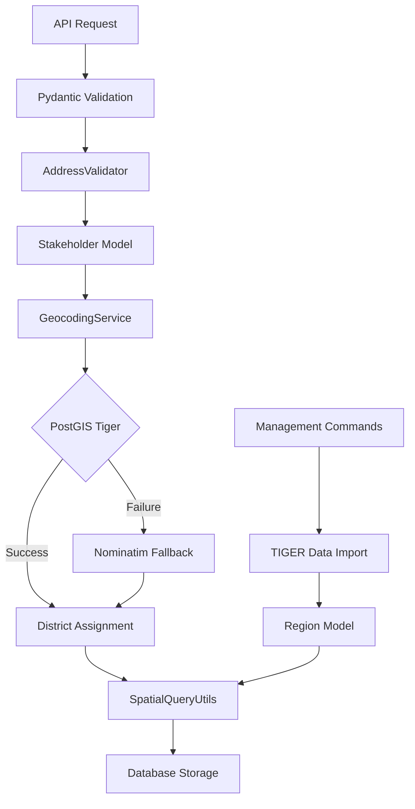

# Geocoding and Address Validation Architecture

This document describes the technical architecture and implementation details of the address validation and geocoding system.

## Architecture Overview



## Core Components

### 1. Address Validation Layer

**File**: `coalition/stakeholders/validators.py`

The `AddressValidator` class provides static methods for validating US address components:

```python
class AddressValidator:
    """Utility class for validating US address components"""

    US_STATES = {
        "AL", "AK", "AZ", "AR", "CA", "CO", "CT", "DE", "DC", "FL",
        # ... complete list of US states and territories
    }

    @classmethod
    def validate_state(cls, state: str) -> str:
        """Validate and normalize US state abbreviation"""
        if not state:
            raise ValidationError("State is required")
        normalized_state = state.strip().upper()
        if normalized_state not in cls.US_STATES:
            raise ValidationError(f"Invalid state code: {state}")
        return normalized_state
```

**Design Decisions:**

- **Static Methods**: No instance state needed, can be used as utility functions
- **Immutable State List**: US states rarely change, defined as class constant
- **Early Validation**: Fail fast with descriptive error messages
- **Normalization**: Automatically fix common formatting issues (case, whitespace)

### 2. Geocoding Service Layer

**File**: `coalition/stakeholders/services.py`

The `GeocodingService` class implements a multi-tier geocoding strategy:

```python
class GeocodingService:
    """Service for geocoding addresses and assigning legislative districts"""

    def __init__(self) -> None:
        # Initialize Nominatim geocoder as fallback
        self.nominatim = Nominatim(user_agent="coalition-builder")

    def geocode_address(
        self,
        street_address: str,
        city: str,
        state: str,
        zip_code: str,
    ) -> Point | None:
        """Geocode address using multi-tier strategy"""

        # 1. Validate address components
        try:
            validated = AddressValidator.validate_complete_address(
                street_address=street_address,
                city=city,
                state=state,
                zip_code=zip_code,
            )
        except ValidationError as e:
            logger.warning("Address validation failed: %s", e)
            return None

        # 2. Try PostGIS Tiger geocoder (primary)
        result = self._geocode_with_tiger(validated)
        if result:
            return result

        # 3. Fall back to Nominatim
        return self._geocode_with_nominatim(validated)
```

**Design Decisions:**

- **Dependency Injection**: External services injected at initialization
- **Graceful Degradation**: Multiple geocoding services with fallback
- **Error Isolation**: Service failures don't crash the application
- **Logging**: Comprehensive logging for debugging and monitoring

### 3. Spatial Query Layer

**File**: `coalition/stakeholders/spatial.py`

The `SpatialQueryUtils` class provides geographic analysis capabilities:

```python
class SpatialQueryUtils:
    """Utilities for spatial queries and geographic analysis"""

    def find_stakeholders_near_point(
        self,
        latitude: float,
        longitude: float,
        distance_km: float = 10,
        stakeholder_type: str | None = None,
    ) -> list[Stakeholder]:
        """Find stakeholders within distance of a point"""

        point = Point(longitude, latitude, srid=4326)
        distance_m = distance_km * 1000

        queryset = Stakeholder.objects.filter(
            location__distance_lte=(point, D(m=distance_m))
        ).select_related(
            "congressional_district",
            "state_legislative_upper",
            "state_legislative_lower",
        )

        if stakeholder_type:
            queryset = queryset.filter(type=stakeholder_type)

        return list(queryset.order_by(
            self._distance_expression(point)
        ))
```

**Design Decisions:**

- **GeoDjango Integration**: Leverages Django's spatial capabilities
- **Optimized Queries**: Uses `select_related()` to avoid N+1 queries
- **Flexible Parameters**: Optional filtering and sorting options
- **Distance Units**: Consistent use of meters internally, kilometers in API

### 4. Data Model Layer

**File**: `coalition/stakeholders/models.py`

The enhanced `Stakeholder` model includes address and location fields:

```python
class Stakeholder(models.Model):
    # ... existing fields ...

    # Address fields
    street_address = models.CharField(max_length=255, blank=True)
    city = models.CharField(max_length=100, blank=True)
    state = models.CharField(max_length=2, blank=True, db_index=True)
    zip_code = models.CharField(max_length=10, blank=True)
    county = models.CharField(max_length=100, blank=True)

    # Geographic fields
    location = PointField(
        blank=True,
        null=True,
        spatial_index=True,
        geography=True,
        verbose_name="Geographic Location",
        help_text="Latitude and longitude coordinates"
    )

    # District relationships
    congressional_district = models.ForeignKey(
        "regions.Region",
        on_delete=models.SET_NULL,
        null=True,
        blank=True,
        related_name="congressional_stakeholders",
        limit_choices_to={"type": "congressional_district"},
    )

    def save(self, *args, **kwargs):
        """Override save to normalize fields"""
        if self.email:
            self.email = self.email.lower()
        if self.state:
            self.state = self.state.upper()
        super().save(*args, **kwargs)
```

**Design Decisions:**

- **Geographic Fields**: Using PostGIS geography type for accurate distance calculations
- **Spatial Indexing**: Automatic spatial indexes for query performance
- **Foreign Key Constraints**: `limit_choices_to` ensures data integrity
- **Field Normalization**: Automatic case normalization in `save()` method
- **Nullable Relationships**: Districts can be null if geocoding fails

### 5. API Integration Layer

**File**: `coalition/api/schemas.py`

Pydantic schemas handle API validation and serialization:

```python
class StakeholderCreateSchema(BaseModel):
    name: str = Field(min_length=1, max_length=255)
    organization: str = Field(default="", max_length=255)
    email: str = Field(max_length=254)
    street_address: str = Field(default="", max_length=255)
    city: str = Field(default="", max_length=100)
    state: str = Field(default="", max_length=2)
    zip_code: str = Field(default="", max_length=10)
    county: str = Field(default="", max_length=100)
    type: str = Field(max_length=50)

    @validator("state")
    def validate_state(cls, v: str) -> str:  # noqa: N805
        """Validate US state abbreviation"""
        if v:
            return AddressValidator.validate_state(v)
        return v
```

**Design Decisions:**

- **Pydantic Integration**: Leverages Django Ninja's Pydantic support
- **Field Validation**: Custom validators call AddressValidator methods
- **Optional Address**: Address fields are optional to support existing data
- **API-First**: Schema-driven development ensures API consistency

## Data Flow

### 1. Stakeholder Creation Flow

```python
# 1. API Request with address data
POST /api/stakeholders/
{
    "name": "John Doe",
    "street_address": "123 Main St",
    "city": "Baltimore",
    "state": "MD",
    "zip_code": "21201",
    "type": "individual"
}

# 2. Pydantic validation calls AddressValidator
StakeholderCreateSchema.validate_state("MD") -> "MD"

# 3. Model instance created and saved
stakeholder = Stakeholder.objects.create(**validated_data)

# 4. Automatic geocoding triggered
if stakeholder.has_complete_address:
    service = GeocodingService()
    service.geocode_and_assign_districts(stakeholder)

# 5. Districts assigned via spatial query
point = Point(-76.6122, 39.2904, srid=4326)
districts = service.assign_legislative_districts(point)
stakeholder.congressional_district = districts['congressional_district']
```

### 2. Geocoding Process Flow

```python
def geocode_and_assign_districts(self, stakeholder) -> bool:
    # 1. Validate address completeness
    if not stakeholder.has_complete_address:
        stakeholder.geocoding_failed = True
        return False

    # 2. Attempt geocoding
    point = self.geocode_address(
        stakeholder.street_address,
        stakeholder.city,
        stakeholder.state,
        stakeholder.zip_code
    )

    # 3. Handle geocoding result
    if point:
        stakeholder.location = point
        stakeholder.geocoded_at = timezone.now()
        stakeholder.geocoding_failed = False

        # 4. Assign legislative districts
        districts = self.assign_legislative_districts(point)
        stakeholder.congressional_district = districts['congressional_district']
        stakeholder.state_senate_district = districts['state_senate_district']
        stakeholder.state_house_district = districts['state_house_district']

        stakeholder.save()
        return True
    else:
        stakeholder.geocoding_failed = True
        stakeholder.save()
        return False
```

## Database Schema

### Tables and Relationships

```sql
-- Stakeholder table with address fields
CREATE TABLE stakeholders_stakeholder (
    id SERIAL PRIMARY KEY,
    name VARCHAR(255) NOT NULL,
    email VARCHAR(254) NOT NULL,
    street_address VARCHAR(255),
    city VARCHAR(100),
    state VARCHAR(2),
    zip_code VARCHAR(10),
    county VARCHAR(100),
    location GEOMETRY(POINT, 4326),
    congressional_district_id INTEGER REFERENCES regions_region(id),
    state_legislative_upper_id INTEGER REFERENCES regions_region(id),
    state_legislative_lower_id INTEGER REFERENCES regions_region(id),
    geocoded_at TIMESTAMP WITH TIME ZONE,
    geocoding_failed BOOLEAN DEFAULT FALSE,
    created_at TIMESTAMP WITH TIME ZONE DEFAULT NOW(),
    updated_at TIMESTAMP WITH TIME ZONE DEFAULT NOW()
);

-- Spatial index for location queries
CREATE INDEX stakeholders_stakeholder_location_idx
ON stakeholders_stakeholder USING GIST (location);

-- Index for state filtering
CREATE INDEX stakeholders_stakeholder_state_idx
ON stakeholders_stakeholder (state);

-- Regions table for legislative districts
CREATE TABLE regions_region (
    id SERIAL PRIMARY KEY,
    geoid VARCHAR(20) NOT NULL,
    name VARCHAR(255) NOT NULL,
    abbrev VARCHAR(10),
    type VARCHAR(30) NOT NULL,
    coords GEOMETRY(POINT, 4326),
    geom GEOMETRY(MULTIPOLYGON, 4326),
    geojson JSONB,
    created_at TIMESTAMP WITH TIME ZONE DEFAULT NOW()
);

-- Spatial index for district boundaries
CREATE INDEX regions_region_geom_idx
ON regions_region USING GIST (geom);

-- Index for district type filtering
CREATE INDEX regions_region_type_idx
ON regions_region (type);
```

### Spatial Queries

**Point-in-Polygon for District Assignment:**

```sql
SELECT r.id, r.name, r.abbrev, r.type
FROM regions_region r
WHERE r.type = 'congressional_district'
  AND ST_Contains(r.geom, ST_SetSRID(ST_Point(-76.6122, 39.2904), 4326));
```

**Distance-Based Stakeholder Search:**

```sql
SELECT s.*, ST_Distance(s.location, ST_SetSRID(ST_Point(-76.6122, 39.2904), 4326)) as distance
FROM stakeholders_stakeholder s
WHERE ST_DWithin(s.location, ST_SetSRID(ST_Point(-76.6122, 39.2904), 4326), 10000)
ORDER BY distance;
```

## Performance Considerations

### Database Optimization

1. **Spatial Indexes**: GIST indexes on all geometry fields
2. **Compound Indexes**: Consider `(state, type)` for stakeholder filtering
3. **Partial Indexes**: Index only geocoded stakeholders for location queries
4. **Connection Pooling**: Use pgbouncer for high-traffic deployments

### Query Optimization

1. **Select Related**: Always use `select_related()` for district relationships
2. **Prefetch Related**: Use `prefetch_related()` for reverse relationships
3. **Query Batching**: Process geocoding in batches to avoid memory issues
4. **Caching**: Cache district boundaries and frequently accessed regions

### Memory Management

```python
# Good: Process in batches
def geocode_stakeholders_batch(batch_size=100):
    stakeholders = Stakeholder.objects.filter(
        location__isnull=True,
        geocoding_failed=False
    ).only('id', 'street_address', 'city', 'state', 'zip_code')

    for batch in chunked(stakeholders, batch_size):
        for stakeholder in batch:
            service.geocode_and_assign_districts(stakeholder)

        # Clear Django query cache
        django.db.reset_queries()

# Bad: Load all at once
def geocode_all_stakeholders():
    stakeholders = Stakeholder.objects.all()  # Memory intensive
    for stakeholder in stakeholders:
        service.geocode_and_assign_districts(stakeholder)
```

## Error Handling

### Exception Hierarchy

```python
# Custom exceptions for different error types
class GeocodingError(Exception):
    """Base exception for geocoding errors"""
    pass

class AddressValidationError(GeocodingError):
    """Address validation failed"""
    pass

class GeocodingServiceError(GeocodingError):
    """External geocoding service error"""
    pass

class DistrictAssignmentError(GeocodingError):
    """District assignment failed"""
    pass
```

### Error Recovery

```python
def geocode_with_retry(self, stakeholder, max_retries=3):
    """Geocode with exponential backoff retry"""
    for attempt in range(max_retries):
        try:
            return self.geocode_and_assign_districts(stakeholder)
        except GeocodingServiceError as e:
            if attempt == max_retries - 1:
                stakeholder.geocoding_failed = True
                stakeholder.save()
                logger.error("Geocoding failed after %d attempts: %s", max_retries, e)
                return False

            wait_time = 2 ** attempt  # Exponential backoff
            time.sleep(wait_time)
            logger.warning("Geocoding attempt %d failed, retrying in %ds", attempt + 1, wait_time)
```

## Testing Strategy

### Unit Tests

```python
class TestAddressValidator(TestCase):
    def test_validate_state_valid(self):
        assert AddressValidator.validate_state("MD") == "MD"
        assert AddressValidator.validate_state("md") == "MD"
        assert AddressValidator.validate_state(" CA ") == "CA"

    def test_validate_state_invalid(self):
        with self.assertRaisesRegex(ValidationError, "Invalid state code"):
            AddressValidator.validate_state("XX")
```

### Integration Tests

```python
class TestGeocodingService(TestCase):
    @patch('coalition.stakeholders.services.connection')
    def test_geocode_with_tiger_success(self, mock_connection):
        # Mock PostGIS Tiger geocoder response
        mock_cursor = MagicMock()
        mock_cursor.fetchone.return_value = (-76.6122, 39.2904, 10)
        mock_connection.cursor.return_value.__enter__.return_value = mock_cursor

        service = GeocodingService()
        result = service._geocode_with_tiger({
            'street_address': '123 Main St',
            'city': 'Baltimore',
            'state': 'MD',
            'zip_code': '21201'
        })

        assert isinstance(result, Point)
        assert result.x == -76.6122
        assert result.y == 39.2904
```

### Spatial Tests

```python
class TestSpatialQueries(TestCase):
    def setUp(self):
        # Create test regions with known geometry
        self.congressional_district = Region.objects.create(
            geoid="2403",
            name="Maryland District 3",
            type="congressional_district",
            geom=MultiPolygon(Polygon([
                (-76.7, 39.2), (-76.7, 39.3),
                (-76.5, 39.3), (-76.5, 39.2),
                (-76.7, 39.2)
            ]))
        )

    def test_district_assignment(self):
        point = Point(-76.6, 39.25)  # Inside district
        utils = SpatialQueryUtils()

        district = utils.find_district_for_point(point, "congressional_district")
        assert district.geoid == "2403"
```

## Security Considerations

### Data Privacy

1. **Address Anonymization**: Consider hashing addresses for analytics
2. **Geocoding Logs**: Don't log full addresses in production
3. **API Rate Limiting**: Prevent abuse of geocoding endpoints
4. **Access Control**: Restrict spatial queries to authorized users

### External Service Security

```python
class GeocodingService:
    def __init__(self):
        # Use generic user agent to avoid tracking
        self.nominatim = Nominatim(
            user_agent="coalition-builder",
            timeout=10,  # Prevent hanging requests
        )

    def _geocode_with_nominatim(self, address_data):
        try:
            # Only send normalized address, no PII
            query = f"{address_data['street_address']}, {address_data['city']}, {address_data['state']} {address_data['zip_code']}"
            location = self.nominatim.geocode(query)
            return Point(location.longitude, location.latitude, srid=4326) if location else None
        except (GeocoderServiceError, GeocoderTimedOut) as e:
            logger.warning("Nominatim geocoding failed: %s", e)
            return None
```

## Monitoring and Observability

### Metrics to Track

1. **Geocoding Success Rate**: Percentage of successful geocoding attempts
2. **Service Response Time**: Average time for geocoding requests
3. **District Assignment Accuracy**: Manual verification of district assignments
4. **API Usage Patterns**: Geographic distribution of requests

### Logging Configuration

```python
LOGGING = {
    'loggers': {
        'coalition.stakeholders.services': {
            'level': 'INFO',
            'handlers': ['file', 'console'],
            'propagate': False,
        },
        'coalition.stakeholders.spatial': {
            'level': 'DEBUG',
            'handlers': ['file'],
            'propagate': False,
        },
    },
}
```

### Health Checks

```python
def geocoding_health_check():
    """Health check for geocoding services"""
    try:
        service = GeocodingService()
        # Test with known good address
        result = service.geocode_address(
            "1600 Pennsylvania Avenue NW",
            "Washington",
            "DC",
            "20500"
        )
        return result is not None
    except Exception:
        return False
```

This architecture provides a robust, scalable foundation for address validation and geocoding that can handle the Coalition Builder's requirements while maintaining data quality and performance.
