# Coalition Builder

A modern platform for organizing and managing policy advocacy campaigns with stakeholder engagement tracking, endorsement collection, and geographic intelligence.

## Key Capabilities

Organizations use this platform to:

- **Manage Advocacy Campaigns**: Create and track policy initiatives at federal and state levels
- **Collect Verified Endorsements**: Streamline supporter engagement with built-in verification and moderation
- **Ensure Legal Compliance**: GDPR-compliant cookie consent and comprehensive legal document management
- **Customize Their Presence**: Dynamic content management and comprehensive theming system
- **Target Geographically**: Leverage PostGIS integration for precise district-based organizing
- **Track Campaign Impact**: Monitor endorsement metrics and stakeholder distribution

## How Organizations Use Coalition Builder

### Campaign Lifecycle & Advocacy Workflow

```mermaid
%%{init: {'theme':'basic'}}%%
flowchart TD
    A[🎯 Create Campaign] --> B[👥 Recruit Stakeholders]
    B --> C[✅ Collect Endorsements]
    C --> D[📊 Track Progress]
    D --> E[🏛️ Engage Legislators]
    E --> F[📢 Drive Policy Change]
```



Coalition Builder guides your organization through the complete advocacy process:

- **Create Campaign**: Launch policy initiatives around federal or state legislation
- **Recruit Stakeholders**: Identify and engage diverse supporters (businesses, nonprofits, citizens, government officials)
- **Collect Endorsements**: Secure verified support with built-in spam protection
- **Track Progress**: Analyze geographic distribution and engagement metrics
- **Engage Legislators**: Target representatives using congressional district data
- **Drive Policy Change**: Export supporter data and coordinate strategic advocacy

### Core Components & Relationships

```mermaid
%%{init: {'theme':'basic'}}%%
flowchart TD
    Stakeholders[👥 Stakeholders<br/>Businesses, Nonprofits, Citizens, Government]
    Regions[🗺️ Regions<br/>States, Counties, Districts]
    Legislators[🏛️ Legislators<br/>Federal, State]

    subgraph Core["🎯 Core Platform"]
        Campaigns[📋 Policy Campaigns]
        Endorsements[📝 Verified Endorsements]
    end

    Legislation[📜 Legislation<br/>Federal Bills, State Bills]

    Stakeholders --> Endorsements
    Campaigns --> Endorsements
    Campaigns --> Legislation
    Regions --> Stakeholders
    Regions --> Legislators
    Regions --> Legislation
    Legislators --> Legislation
```



**Coalition Builder manages**:

- **Diverse stakeholder categories** across sectors and organizational types
- **Multi-level campaigns** linking federal and state legislation
- **Verified endorsements** with geographic and legislative targeting
- **Geographic intelligence** for strategic advocacy and outreach

## Architecture

### Serverless Architecture (Current)

- **Backend**: Django API on AWS Lambda (via Zappa)
- **Frontend**: Next.js on Vercel Edge Network
- **Database**: PostgreSQL with PostGIS (RDS)
- **Rate Limiting**: DynamoDB (serverless)
- **Infrastructure**: Terraform-managed AWS resources
- **Cost**: ~$39/month (46% reduction from ECS)

### Legacy Architecture (Deprecated)

- **Backend**: Django API on ECS Fargate
- **Frontend**: Next.js on ECS with SSR
- **Infrastructure**: ALB + ECS + NAT Gateway
- **Cost**: ~$73/month

### Frontend Architecture

Coalition Builder uses a Next.js-based frontend architecture with server-side rendering for optimal SEO and performance.

#### How the Frontend Works

The `/frontend` directory contains a Next.js application that serves as the primary user interface:

1. **Server-Side Rendering**: Next.js pre-renders pages on the server for better SEO
2. **API Integration**: Frontend fetches data from Django backend via `/api/*` routes
3. **Optimized Performance**: Automatic code splitting and optimized bundle sizes
4. **React Components**: Modern React with TypeScript for type safety
5. **Styled Components**: CSS-in-JS for component-level styling

#### Request Routing

```
/* → Next.js Frontend (SSR)
/api/* → Django API
/admin/* → Django Admin
/static/* → Django Static Files
```

#### Key Benefits

- **SEO Optimized**: Server-side rendering ensures search engines can index content
- **Fast Initial Load**: Pre-rendered HTML for instant page display
- **Type Safety**: Full TypeScript support across the application
- **Modern Stack**: Latest React and Next.js features
- **Production Ready**: Serverless deployment with Lambda and Vercel

## Getting Started

1. **[Installation](installation.md)** - Quick setup for development
2. **[Configuration](configuration.md)** - Environment variables and settings
3. **[Development](development.md)** - Development workflow and contributing
4. **[Lambda Deployment](LAMBDA_DEPLOYMENT.md)** - Backend deployment to AWS Lambda
5. **[Vercel Deployment](VERCEL_DEPLOYMENT.md)** - Frontend deployment to Vercel
6. **[Legacy Deployment](deployment.md)** - ECS deployment (deprecated)

## User Guides

Comprehensive guides for managing your coalition platform:

- **[Endorsement Workflow](user-guides/endorsement-workflow.md)** - Collect and manage campaign endorsements
- **[Legal Compliance](user-guides/legal-compliance.md)** - Configure Terms of Use, Privacy Policy, and GDPR cookie consent
- **[Content Management](user-guides/content-management.md)** - Complete guide to the Django admin interface
  - **[Campaign Management](user-guides/campaign-management.md)** - Create and manage policy advocacy campaigns
  - **[Stakeholder Management](user-guides/stakeholder-management.md)** - Organize and engage with supporters and partners
  - **[Homepage Management](user-guides/homepage-management.md)** - Configure organization branding and homepage content
  - **[Theme Management](user-guides/theme-management.md)** - Customize branding, colors, and visual appearance

## Development Guides

- **[Development Setup](development/setup.md)** - Detailed environment setup including automated tooling
- **[Testing Guide](development/testing.md)** - Comprehensive testing with pytest, Jest, and Go
- **[Site Password Protection](development/automated-protection.md)** - Configure site-wide authentication for development and production
- **[Email Configuration](email-configuration.md)** - Set up AWS SES for transactional emails

## Deployment Guides

- **[Lambda Deployment](LAMBDA_DEPLOYMENT.md)** - Deploy Django to AWS Lambda with Zappa
- **[Vercel Deployment](VERCEL_DEPLOYMENT.md)** - Deploy Next.js to Vercel Edge Network
- **[GitHub Workflows](deployment/workflows.md)** - CI/CD pipelines for automated deployment
- **[Geographic Data Import](deployment/geodata-import.md)** - Import TIGER shapefiles via ECS

## Documentation

- **[Database Models](architecture/models.md)** - Visual diagrams and documentation of database structure
- **[Endorsement Workflow](user-guides/endorsement-workflow.md)** - Complete endorsement system process flow with Mermaid diagrams
- **[API Reference](https://lhadjchikh.github.io/coalition-builder/api/)** - Auto-generated from Django models and views
- **[Frontend Components](https://lhadjchikh.github.io/coalition-builder/frontend-api/)** - Auto-generated from React components
- **[Environment Variables](reference/environment.md)** - Complete configuration reference
- **[CLI Reference](reference/cli.md)** - Command-line tools and Django management commands

## Support

- Issues and feature requests: [GitHub Issues](https://github.com/lhadjchikh/coalition-builder/issues)
- Development questions: See [Development Guide](development.md)
- Deployment help: See [Deployment Guide](deployment.md)
