# Coalition Builder

A modern platform for organizing and managing policy advocacy campaigns with stakeholder engagement tracking, endorsement collection, and geographic intelligence.

## Overview

Coalition Builder enables organizations to:

- **Build Coalitions**: Manage advocacy campaigns and stakeholder engagement
- **Collect Endorsements**: Streamlined collection with verification and moderation
- **Manage Content**: Dynamic homepage with customizable content blocks
- **Custom Branding**: Comprehensive theme system for visual customization
- **Geographic Intelligence**: PostGIS integration for address geocoding and district assignment

## How Organizations Use Coalition Builder

### Campaign Lifecycle & Advocacy Workflow

```mermaid
%%{init: {'theme':'basic'}}%%
flowchart TD
    A[🎯 Create Campaign] --> B[👥 Build Coalition]
    B --> C[✅ Collect Endorsements]
    C --> D[📊 Track Progress]
    D --> E[🏛️ Engage Legislators]
    E --> F[📢 Drive Policy Change]
```



Coalition Builder guides your organization through the complete advocacy process:

- **Create Campaign**: Launch policy initiatives around federal or state legislation
- **Build Coalition**: Recruit diverse stakeholders (businesses, nonprofits, citizens, government officials)
- **Collect Endorsements**: Secure verified support with built-in spam protection
- **Track Progress**: Analyze geographic distribution and engagement metrics
- **Engage Legislators**: Target representatives using congressional district data
- **Drive Policy Change**: Export supporter data and coordinate strategic advocacy

### Core Components & Relationships

```mermaid
%%{init: {'theme':'basic'}}%%
flowchart TD
    Stakeholders[👥 Stakeholders<br/>Businesses, Nonprofits, Citizens, Government]
    Regions[🗺️ Regions<br/>States, Counties, Districts]
    Legislators[🏛️ Legislators<br/>Federal, State]

    subgraph Core["🎯 Core Platform"]
        Campaigns[📋 Policy Campaigns]
        Endorsements[📝 Verified Endorsements]
    end

    Legislation[📜 Legislation<br/>Federal Bills, State Bills]

    Stakeholders --> Endorsements
    Campaigns --> Endorsements
    Campaigns --> Legislation
    Regions --> Stakeholders
    Regions --> Legislators
    Regions --> Legislation
    Legislators --> Legislation
```



**Coalition Builder manages**:

- **Diverse stakeholder categories** across sectors and organizational types
- **Multi-level campaigns** linking federal and state legislation
- **Verified endorsements** with geographic and legislative targeting
- **Geographic intelligence** for strategic advocacy and outreach

## Architecture

- **Backend**: Django API with PostgreSQL/PostGIS
- **Frontend**: React with TypeScript and styled-components
- **SSR**: Next.js for SEO optimization (optional)
- **Infrastructure**: Terraform-managed AWS deployment

### Frontend Architecture

Coalition Builder uses a flexible frontend architecture that supports both traditional SPA deployment and optional server-side rendering (SSR).

#### How the Frontend Works

The `/frontend` directory contains a React application built with Webpack that serves as the primary user interface. This single codebase works in two different deployment modes:

**Without SSR (Default Mode):**

1. React app is built into static files (JS/CSS with cache-busting hashes)
2. Django serves these files through a template (`index.html`)
3. Django's `home` view reads `asset-manifest.json` to inject correct file paths
4. React takes over as a single-page application in the browser
5. API calls go to Django backend via `/api/*` routes

**With SSR (Optional Mode):**

1. Next.js handles server-side rendering for better SEO
2. Django serves only API endpoints (`/api/*`, `/admin/*`)
3. nginx routes frontend requests (`/*`) to Next.js instead of Django
4. Next.js imports and renders the same React components from `/frontend/src/components/`
5. Shared error handling logic ensures consistent behavior in both modes

#### Request Routing

**SSR Disabled:**

```
/* → Django home view → React SPA
/api/* → Django API
/admin/* → Django Admin
```

**SSR Enabled:**

```
/* → Next.js SSR
/api/* → Django API
/admin/* → Django Admin
```

#### Key Benefits

- **Single Frontend Codebase**: Write once, deploy with or without SSR
- **Django Integration**: Static files served through Django's static system
- **Asset Management**: Automatic cache-busting via asset manifest
- **Deployment Flexibility**: Choose complexity vs. performance trade-offs
- **Fallback Strategy**: Can disable SSR without losing frontend functionality

This architecture allows organizations to start simple (Django + React SPA) and add SSR later for improved SEO without rewriting their frontend code.

## Getting Started

1. **[Installation](installation.md)** - Quick setup for development
2. **[Configuration](configuration.md)** - Environment variables and settings
3. **[Development](development.md)** - Development workflow and contributing
4. **[Deployment](deployment.md)** - Production deployment options

## User Guides

Comprehensive guides for managing your coalition platform:

- **[Theme Management](user-guides/theme-management.md)** - Customize branding, colors, and visual appearance
- **[Homepage Management](user-guides/homepage-management.md)** - Configure organization branding and homepage content
- **[Campaign Management](user-guides/campaign-management.md)** - Create and manage policy advocacy campaigns
- **[Stakeholder Management](user-guides/stakeholder-management.md)** - Organize and engage with supporters and partners
- **[Endorsement Workflow](user-guides/endorsement-workflow.md)** - Collect and manage campaign endorsements
- **[Content Management](user-guides/content-management.md)** - Complete guide to the Django admin interface

## Development Guides

- **[Development Setup](development/setup.md)** - Detailed environment setup including automated tooling
- **[Testing Guide](development/testing.md)** - Comprehensive testing with pytest, Jest, and Go
- **[Site Password Protection](development/automated-protection.md)** - Configure site-wide authentication for development and production

## Documentation

- **[Database Models](architecture/models.md)** - Visual diagrams and documentation of database structure
- **[Endorsement Workflow](architecture/endorsement-workflow.md)** - Complete endorsement system process flow with Mermaid diagrams
- **[API Reference](api/)** - Auto-generated from Django models and views
- **[Frontend Components](frontend-api/)** - Auto-generated from React components
- **[Environment Variables](reference/environment.md)** - Complete configuration reference
- **[CLI Reference](reference/cli.md)** - Command-line tools and Django management commands

## Support

- Issues and feature requests: [GitHub Issues](https://github.com/lhadjchikh/coalition-builder/issues)
- Development questions: See [Development Guide](development.md)
- Deployment help: See [Deployment Guide](deployment.md)
