# Endorsement Workflow Guide

This guide explains how the endorsement system works in Coalition Builder, covering both the public-facing endorsement process and the administrative workflow for managing endorsements.

## Overview

Coalition Builder's endorsement system allows stakeholders to publicly support your policy campaigns through a streamlined process that includes:

- **Public endorsement forms** for each campaign
- **Email verification** to prevent spam and ensure authenticity
- **Administrative moderation** to review and approve endorsements
- **Public display** of approved endorsements
- **Spam protection** and security measures

## Complete Workflow Diagram

The following diagram illustrates the complete endorsement system workflow from form submission to public display:

> **Note**: This diagram uses Mermaid syntax and will render automatically on GitHub and other platforms that support Mermaid.

```mermaid
%%{init: {'theme':'basic'}}%%
flowchart TD
    %% User Journey
    A[User Loads Endorsement Form] --> B[User Fills Form Data]
    B --> C{Form Submission}

    %% Spam Prevention Layer
    C --> D[Rate Limiting Check]
    D --> E[Honeypot Field Validation]
    E --> F[Form Timing Analysis]
    F --> G[Email Reputation Check]
    G --> H[Content Quality Analysis]
    H --> I[IP Validation]

    %% Spam Detection Decision
    I --> J{Spam Detected?}
    J -->|Yes| K[❌ Block Submission]
    J -->|No| L[Process Stakeholder Data]

    %% Stakeholder Processing
    L --> M[Email-based Deduplication]
    M --> N{Stakeholder Exists?}
    N -->|Yes| O[Validate Data Match]
    N -->|No| P[Create New Stakeholder]
    O --> Q[HTML Sanitization]
    P --> R[Geocoding & District Assignment]
    R --> Q

    %% Endorsement Creation
    Q --> S[Create Endorsement Record]
    S --> T[Status: PENDING]
    T --> U[Generate Verification Token]
    U --> V[Send Verification Email]

    %% Email Verification Flow
    V --> W[User Receives Email]
    W --> X{User Clicks Link?}
    X -->|No| Y[Token Expires 24hrs]
    X -->|Yes| Z[Verify Token]

    Z --> AA{Token Valid?}
    AA -->|No| BB[❌ Invalid Token]
    AA -->|Yes| CC{Auto-Approval Enabled?}

    %% Status Transitions
    CC -->|Yes| DD[Status: APPROVED]
    CC -->|No| EE[Status: VERIFIED]

    DD --> FF[Send Approval Email]
    EE --> GG[Admin Review Queue]

    %% Admin Moderation
    GG --> HH{Admin Action}
    HH -->|Approve| II[Status: APPROVED]
    HH -->|Reject| JJ[Status: REJECTED]

    II --> KK[Send Approval Email]
    JJ --> LL[Send Rejection Email]

    %% Public Display
    FF --> MM[Public Display Check]
    KK --> MM
    MM --> NN{Display Criteria Met?}
    NN -->|Yes| OO[✅ Publicly Displayed]
    NN -->|No| PP[❌ Not Displayed]

    %% Error Paths
    K --> QQ[Show Error Message]
    BB --> RR[Show Verification Error]
    Y --> SS[Allow Resend Email]
    LL --> TT[Internal Record Only]

    %% Styling
    classDef pending fill:#ffeb3b,stroke:#f57f17,color:#000
    classDef verified fill:#2196f3,stroke:#0d47a1,color:#fff
    classDef approved fill:#4caf50,stroke:#1b5e20,color:#fff
    classDef rejected fill:#f44336,stroke:#b71c1c,color:#fff
    classDef error fill:#ff5722,stroke:#bf360c,color:#fff
    classDef process fill:#e3f2fd,stroke:#1976d2,color:#000

    class T,U,V pending
    class EE,GG verified
    class DD,II,FF,KK,OO approved
    class JJ,LL,PP,TT rejected
    class K,BB,QQ,RR error
    class D,E,F,G,H,I,L,M,Q,S process
```

## How Endorsements Work

### Public Endorsement Process

**Step 1: Discovery**

- Stakeholders visit your campaign page
- They see an "Endorse This Campaign" button or form
- The form is prominently displayed on campaign detail pages

**Step 2: Form Submission**

- Stakeholders fill out the endorsement form with:
  - Organization/Individual name
  - Title/Position (optional)
  - Contact information
  - Endorsement statement (optional)
  - Organization type (nonprofit, business, individual, etc.)

**Step 3: Email Verification**

- System sends verification email to provided address
- Stakeholder clicks verification link
- Endorsement moves to "Verified" status

**Step 4: Administrative Review**

- Verified endorsements appear in admin queue
- Administrators review and approve/reject
- Approved endorsements become publicly visible

**Step 5: Public Display**

- Approved endorsements appear on campaign pages with smart engagement features
- Stakeholder information is displayed according to privacy settings
- Endorsements help build campaign credibility and encourage further participation

### Email Verification Details

**Verification Email Contains**:

- Campaign name and brief description
- Verification link (expires after 24 hours)
- Contact information for questions
- Unsubscribe options

**Security Features**:

- Verification links are single-use and time-limited
- Email addresses are validated before sending
- Multiple security measures prevent abuse

## Administrative Workflow

### Accessing Endorsement Management

1. **Navigate to Django Admin**
   - Go to your admin interface
   - Look for "Endorsements" section

2. **Endorsement Status Overview**
   - **Pending**: Newly submitted, awaiting email verification
   - **Verified**: Email verified, awaiting admin approval
   - **Approved**: Live on public campaign pages
   - **Rejected**: Not displayed publicly

### Managing Individual Endorsements

**Review Process**:

1. **Click on an endorsement** to view details
2. **Review submission information**:
   - Stakeholder name and organization
   - Contact information
   - Endorsement statement
   - Submission timestamp
   - Verification status

3. **Check for quality indicators**:
   - Is the organization/individual legitimate?
   - Is the endorsement statement appropriate?
   - Does the contact information look valid?
   - Is this a duplicate endorsement?

4. **Take action**:
   - **Approve**: Make publicly visible
   - **Reject**: Hide from public view (with optional reason)
   - **Edit**: Modify details if needed (use sparingly)

### Bulk Management

**Filtering Options**:

- Filter by campaign
- Filter by status (pending, verified, approved, rejected)
- Filter by organization type
- Filter by submission date

**Bulk Actions**:

- Approve multiple endorsements at once
- Reject multiple endorsements
- Export endorsement data

### Quality Control Guidelines

**Approve endorsements that**:

- Come from legitimate organizations or individuals
- Have appropriate, professional endorsement statements
- Include valid contact information
- Support the campaign's goals appropriately

**Reject endorsements that**:

- Contain spam, promotional content, or irrelevant information
- Use fake or suspicious organization names
- Include inappropriate language or content
- Appear to be duplicates from the same source
- Contain obviously false information

**Edit endorsements when**:

- Minor typos need correction
- Organization names need standardization
- Contact information needs formatting cleanup
- **Note**: Only make essential edits to maintain authenticity

## Anti-Spam Features

### Automatic Protection

**Built-in Safeguards**:

- Multiple automated protection mechanisms prevent spam and abuse
- Email validation ensures legitimate contact information
- Duplicate detection identifies potential repeat submissions
- Content filtering automatically identifies suspicious submissions

### Manual Review Process

**Red Flags to Watch For**:

- Generic organization names (e.g., "Business LLC")
- Suspicious email domains
- Endorsement statements that don't relate to the campaign
- Multiple submissions from similar sources
- Patterns suggesting automated or coordinated submissions

## Managing Stakeholder Information

### Privacy Considerations

**Public Display Options**:

- **Organization Name**: Always displayed for approved endorsements
- **Individual Names**: Displayed based on privacy settings
- **Titles/Positions**: Optional display
- **Contact Information**: Never displayed publicly
- **Endorsement Statements**: Displayed if provided and appropriate

### Data Management

**Contact Information Handling**:

- Email addresses are stored securely
- Contact info is used only for verification
- Stakeholders can update their information
- Unsubscribe options are provided in all communications

**Data Retention and Deletion**:

- Organizations must establish clear data retention policies
- Consider legal requirements for keeping records of advocacy activities
- Implement procedures for handling data deletion requests
- Balance transparency needs with privacy rights
- Consult legal counsel for appropriate retention schedules

!!! warning "Privacy Rights"
Stakeholders may have rights under privacy laws to:

    - Access their personal information
    - Request correction of inaccurate data
    - Request deletion of their data
    - Opt out of certain data uses

    Organizations should establish procedures to handle these requests promptly and in compliance with applicable laws.

## Integration with Campaigns

### Campaign-Specific Features

**Per-Campaign Settings**:

- Enable/disable endorsements for specific campaigns
- Customize endorsement form fields
- Set moderation requirements
- Configure display options

**Endorsement Display**:

- Endorsements appear on campaign detail pages
- Count of endorsements displayed prominently
- Featured endorsements can be highlighted
- Endorsements are categorized by stakeholder type

### Reporting and Analytics

**Endorsement Metrics**:

- Total endorsements per campaign
- Approval rates and timing
- Stakeholder type breakdown
- Geographic distribution (if address provided)
- Submission trends over time

## Communication Templates

### Verification Email Template

Coalition Builder includes customizable email templates for:

**Verification Emails**:

- Welcome message
- Clear verification instructions
- Campaign information
- Organization contact details

**Confirmation Emails**:

- Thank you message after verification
- Next steps information
- Additional engagement opportunities

### Customization Options

**Template Customization**:

- Modify email subject lines
- Customize message content
- Add organization branding
- Include additional links or information

## Best Practices

### For Administrators

**Regular Review Schedule**:

- Check for new endorsements daily during active campaigns
- Set up email notifications for new submissions
- Maintain consistent approval criteria
- Document reasons for rejections

**Quality Maintenance**:

- Regularly audit approved endorsements
- Remove outdated or invalid endorsements
- Keep stakeholder information current
- Monitor for spam patterns

### For Campaign Managers

**Promoting Endorsements**:

- Include endorsement calls-to-action in campaign materials
- Share endorsement process with stakeholder networks
- Highlight prominent endorsements in communications
- Use endorsement counts in campaign messaging

**Stakeholder Engagement**:

- Thank stakeholders for their endorsements
- Keep endorsers updated on campaign progress
- Invite endorsers to additional campaign activities
- Use endorsements to demonstrate broad support

## Troubleshooting

### Common Issues

**Verification emails not received**:

- Check spam/junk folders
- Verify email address accuracy
- Ensure email server is properly configured
- Check email delivery logs

**Endorsements not appearing**:

- Verify endorsement has been approved
- Check campaign endorsement settings
- Clear browser cache
- Confirm endorsement is for correct campaign

**Duplicate endorsements**:

- Review for legitimate multiple submissions
- Check if different campaigns are involved
- Merge duplicates if appropriate
- Improve duplicate detection if needed

### Technical Support

**For technical issues**:

- Check Django admin error logs
- Verify email server configuration
- Test endorsement form functionality
- Contact system administrator for server issues

## Advanced Features

### API Integration

For organizations with custom applications:

- Endorsement data can be accessed via API
- Custom endorsement forms can be created
- Bulk import/export capabilities available
- Integration with external CRM systems possible

### Workflow Automation

**Automated Processes**:

- Automatic content filtering
- Scheduled endorsement reports
- Notification systems for administrators
- Integration with email marketing platforms

This guide covers the complete endorsement workflow from submission to public display. For technical customization or advanced features, consult your system administrator.
