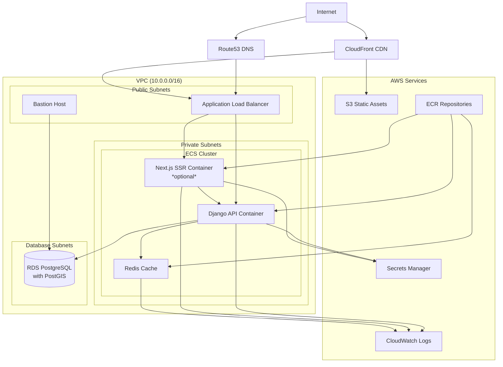

# Terraform Infrastructure for Coalition Builder

[](https://github.com/lhadjchikh/coalition-builder/actions/workflows/test_terraform.yml)
[](https://www.terraform.io/)
[](https://registry.terraform.io/providers/hashicorp/aws/latest)

This directory contains the Terraform configuration for deploying Coalition Builder to AWS. The infrastructure is designed to be secure, scalable, and SOC 2 compliant.

## 📚 Documentation

**For complete deployment documentation, visit: [lhadjchikh.github.io/coalition-builder](https://lhadjchikh.github.io/coalition-builder/)**

Quick links:

- [AWS Deployment Guide](https://lhadjchikh.github.io/coalition-builder/deployment/aws/) - Complete AWS setup walkthrough
- [Configuration Reference](https://lhadjchikh.github.io/coalition-builder/reference/environment/) - All environment variables
- [Deployment Overview](https://lhadjchikh.github.io/coalition-builder/deployment/) - Multiple deployment options

## Technology Stack

- **Terraform**: Infrastructure as Code (>= 1.12.0)
- **AWS Provider**: ~> 5.99.0
- **AWS Services**: ECS Fargate, RDS PostgreSQL, S3, ALB, Route53, CloudFront, Secrets Manager
- **Testing**: Terratest with AWS SDK Go v2
- **Security**: WAF, Security Groups, KMS encryption

## Project Structure

```
terraform/
├── modules/
│   ├── compute/              # ECS, ECR, Bastion host
│   ├── database/             # RDS, Parameter groups
│   ├── dns/                  # Route53 records
│   ├── loadbalancer/         # ALB, Target groups
│   ├── monitoring/           # CloudWatch, Cost alerts
│   ├── networking/           # VPC, Subnets, Security groups
│   ├── secrets/              # Secrets Manager, KMS
│   ├── security/             # Security groups, WAF
│   └── storage/              # S3, Static assets
├── scripts/
│   ├── setup_remote_state.sh # Remote state helper
│   └── db_setup.sh           # Database setup
├── tests/                    # Terratest integration tests
│   ├── modules/              # Module-specific tests
│   ├── integration/          # Full-stack tests
│   └── common/               # Test utilities
├── main.tf                   # Main configuration
├── variables.tf              # Input variables
├── outputs.tf                # Output values
└── backend.tf                # Remote state configuration
```

## Architecture Overview

The following diagram shows the complete AWS infrastructure layout:

> **Note**: This diagram uses Mermaid syntax and will render automatically on GitHub and other platforms that support Mermaid. For detailed deployment documentation including this diagram, see the [AWS Deployment Guide](https://lhadjchikh.github.io/coalition-builder/deployment/aws/).



The infrastructure uses a layered security model with:

- **Public Subnets**: Load balancer and bastion host
- **Private Subnets**: ECS containers (Django API + optional Next.js SSR)
- **Database Subnets**: RDS PostgreSQL with PostGIS
- **Security Groups**: Component isolation with least privilege
- **Secrets Manager**: Secure credential storage
- **CloudWatch**: Logging and monitoring
- **Cost Alerts**: Budget monitoring and anomaly detection

### Security Features

- **Network Isolation**: VPC with public/private/database subnets
- **Encryption**: KMS encryption for RDS and Secrets Manager
- **Access Control**: IAM roles with least privilege
- **WAF Protection**: Web Application Firewall rules
- **SSH Access**: Secure bastion host for database access
- **Credential Management**: AWS Secrets Manager integration
