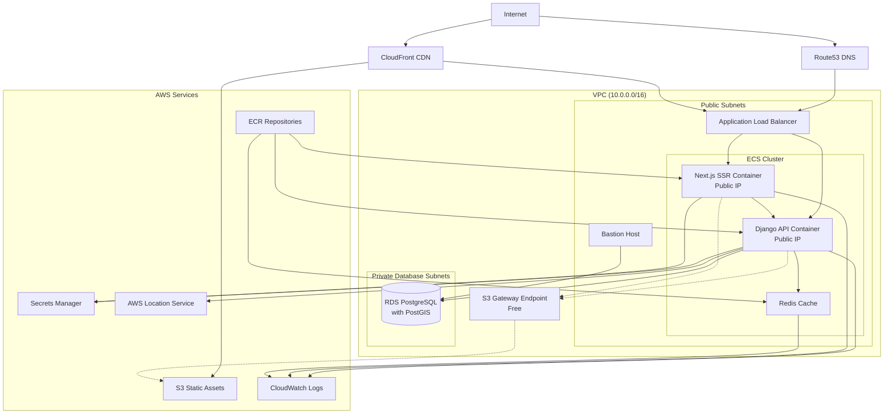

# Terraform Infrastructure for Coalition Builder

[](https://github.com/lhadjchikh/coalition-builder/actions/workflows/test_terraform.yml)
[](https://www.terraform.io/)
[](https://registry.terraform.io/providers/hashicorp/aws/latest)

This directory contains the Terraform configuration for deploying Coalition Builder to AWS. The infrastructure is designed to be secure, scalable, and cost-optimized.

## 📚 Documentation

**For complete deployment documentation, visit: [lhadjchikh.github.io/coalition-builder](https://lhadjchikh.github.io/coalition-builder/)**

Quick links:

- [AWS Deployment Guide](https://lhadjchikh.github.io/coalition-builder/deployment/aws/) - Complete AWS setup walkthrough
- [Configuration Reference](https://lhadjchikh.github.io/coalition-builder/reference/environment/) - All environment variables
- [Deployment Overview](https://lhadjchikh.github.io/coalition-builder/deployment/) - Multiple deployment options

## Technology Stack

- **Terraform**: Infrastructure as Code (>= 1.12.0)
- **AWS Provider**: ~> 5.99.0
- **AWS Services**: ECS Fargate, RDS PostgreSQL, S3, ALB, Route53, CloudFront, Secrets Manager
- **Testing**: Terratest with AWS SDK Go v2
- **Security**: WAF, Security Groups, KMS encryption

## Project Structure

```
terraform/
├── modules/
│   ├── aws-location/         # AWS Location Service for geocoding
│   ├── compute/              # ECS, ECR, Bastion host
│   ├── database/             # RDS, Parameter groups
│   ├── dns/                  # Route53 records
│   ├── loadbalancer/         # ALB, Target groups
│   ├── monitoring/           # CloudWatch, Cost alerts
│   ├── networking/           # VPC, Subnets, S3 endpoint
│   ├── secrets/              # Secrets Manager, KMS
│   ├── security/             # Security groups, WAF
│   └── storage/              # S3, CloudFront CDN
├── scripts/
│   ├── setup_remote_state.sh # Remote state helper
│   └── db_setup.sh           # Database setup
├── tests/                    # Terratest integration tests
│   ├── modules/              # Module-specific tests
│   ├── integration/          # Full-stack tests
│   └── common/               # Test utilities
├── main.tf                   # Main configuration
├── variables.tf              # Input variables
├── outputs.tf                # Output values
└── backend.tf                # Remote state configuration
```

## Architecture Overview

The following diagram shows the complete AWS infrastructure layout:

> **Note**: This diagram uses Mermaid syntax and will render automatically on GitHub and other platforms that support Mermaid. For detailed deployment documentation including this diagram, see the [AWS Deployment Guide](https://lhadjchikh.github.io/coalition-builder/deployment/aws/).



The infrastructure uses a cost-optimized security model with:

- **Public Subnets**: ALB, bastion host, and ECS containers with public IPs
- **Private Database Subnets**: RDS PostgreSQL with PostGIS (isolated)
- **S3 Gateway Endpoint**: Free, efficient S3 access for all VPC resources
- **Security Groups**: Component isolation with least privilege
- **Secrets Manager**: Secure credential storage
- **CloudWatch**: Logging and monitoring
- **Cost Alerts**: Budget monitoring and anomaly detection

### Security Features

- **Network Isolation**: VPC with public and private database subnets
- **Encryption**: KMS encryption for RDS and Secrets Manager
- **Access Control**: IAM roles with least privilege
- **WAF Protection**: Web Application Firewall rules
- **SSH Access**: Secure bastion host for database access
- **Credential Management**: AWS Secrets Manager integration

### Cost Optimization

- **ECS in Public Subnets**: Eliminates NAT Gateway costs (~$45/month savings)
- **S3 Gateway Endpoint**: Free S3 access without data transfer costs
- **Fargate Spot**: Option to use Spot instances for non-critical workloads
- **Auto-scaling**: Automatic scaling based on demand
- **Budget Alerts**: Proactive cost monitoring and alerting

## Quick Start

### Prerequisites

1. **AWS Account**: With appropriate permissions
2. **Terraform**: Version 1.12 or higher
3. **AWS CLI**: Configured with credentials
4. **Domain**: Registered domain with Route53 hosted zone
5. **SSL Certificate**: ACM certificate for HTTPS

### Basic Deployment

```bash
# Clone the repository
git clone https://github.com/lhadjchikh/coalition-builder.git
cd coalition-builder/terraform

# Initialize Terraform
terraform init

# Create terraform.tfvars with your configuration
cat > terraform.tfvars <<EOF
aws_region = "us-east-1"
domain_name = "yourdomain.com"
route53_zone_id = "Z1234567890ABC"
acm_certificate_arn = "arn:aws:acm:us-east-1:123456789012:certificate/..."
alert_email = "admin@yourdomain.com"
EOF

# Plan the deployment
terraform plan

# Apply the configuration
terraform apply
```

## Module Documentation

Each module has its own README with detailed configuration options:

- [Networking](modules/networking/README.md) - VPC and subnet configuration
- [Database](modules/database/README.md) - RDS PostgreSQL with PostGIS
- [Compute](modules/compute/README.md) - ECS Fargate configuration
- [Storage](modules/storage/README.md) - S3 and CloudFront CDN
- [Security](modules/security/README.md) - Security groups and WAF

## Testing

The infrastructure includes comprehensive tests using Terratest:

```bash
# Run all tests
cd tests
go test -v ./...

# Run specific module tests
go test -v ./modules/networking_test.go

# Run integration tests
go test -v ./integration/
```

## Monitoring and Alerts

The infrastructure includes:

- **CloudWatch Dashboards**: ECS, RDS, and ALB metrics
- **Budget Alerts**: Monthly spending limits
- **Anomaly Detection**: Unusual cost patterns
- **Log Aggregation**: Centralized logging in CloudWatch

## Security Compliance

The infrastructure is designed with security best practices:

- **SOC 2 Ready**: Audit logging and access controls
- **HIPAA Capable**: Encryption at rest and in transit
- **PCI DSS**: Network segmentation and WAF protection
- **GDPR**: Data residency and deletion capabilities

## Cost Estimation

Typical monthly costs for a production deployment:

| Service | Configuration | Estimated Cost |
|---------|--------------|---------------|
| ECS Fargate | 0.5 vCPU, 1GB RAM | ~$20 |
| RDS PostgreSQL | db.t4g.micro | ~$15 |
| Application Load Balancer | 1 ALB | ~$20 |
| S3 & CloudFront | 10GB storage, 100GB transfer | ~$10 |
| Route53 | 1 hosted zone | ~$0.50 |
| Secrets Manager | 5 secrets | ~$2.50 |
| CloudWatch | Logs and metrics | ~$5 |
| **Total** | | **~$73/month** |

*Note: Actual costs vary based on usage and region.*

## Support

For issues, questions, or contributions:

1. Check the [documentation](https://lhadjchikh.github.io/coalition-builder/)
2. Search [existing issues](https://github.com/lhadjchikh/coalition-builder/issues)
3. Open a [new issue](https://github.com/lhadjchikh/coalition-builder/issues/new)

## License

This infrastructure code is part of the Coalition Builder project. See the main [LICENSE](../LICENSE) file for details.