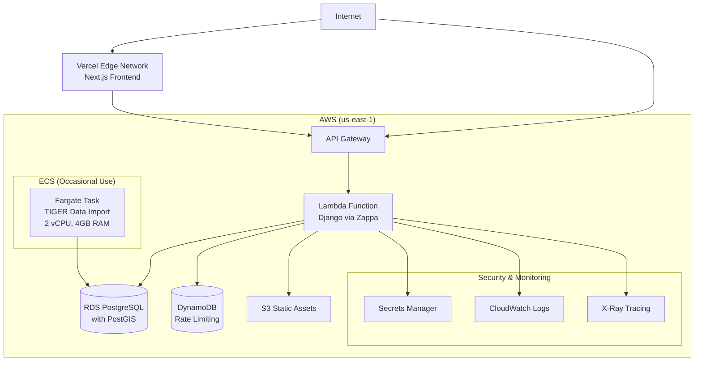

# Terraform Infrastructure for Coalition Builder

[](https://github.com/lhadjchikh/coalition-builder/actions/workflows/test_terraform.yml)
[](https://www.terraform.io/)
[](https://registry.terraform.io/providers/hashicorp/aws/latest)

This directory contains the Terraform configuration for deploying Coalition Builder's serverless infrastructure to AWS. The infrastructure is designed to be secure, scalable, and cost-optimized with a 46% cost reduction from the previous ECS-based deployment.

## 📚 Documentation

**For complete deployment documentation, visit: [lhadjchikh.github.io/coalition-builder](https://lhadjchikh.github.io/coalition-builder/)**

Quick links:

- [Multi-Account AWS Guide](../docs/deployment/multi-account-aws.md) - Bootstrap, OIDC, VPC peering, environment workflow
- [AWS Serverless Guide](../docs/deployment/aws.md) - Complete serverless deployment walkthrough
- [Lambda Deployment](../docs/lambda_deployment.md) - Django on Lambda setup
- [Vercel Deployment](../docs/vercel_deployment.md) - Next.js on Vercel setup
- [Configuration Reference](https://lhadjchikh.github.io/coalition-builder/reference/environment/) - All environment variables
- [Deployment Overview](https://lhadjchikh.github.io/coalition-builder/deployment/) - Multiple deployment options

## Technology Stack

- **Terraform**: Infrastructure as Code (>= 1.12.0)
- **AWS Provider**: ~> 5.99.0
- **AWS Services**: Lambda, API Gateway, RDS PostgreSQL, DynamoDB, S3, Secrets Manager, ECS (TIGER imports only)
- **Testing**: Terratest with AWS SDK Go v2
- **Security**: WAF, Security Groups, KMS encryption

## Project Structure

```text
terraform/
├── environments/
│   ├── shared/               # Shared account (VPC, RDS, Bastion)
│   ├── prod/                 # Production account (Lambda, API GW, S3, SES)
│   └── dev/                  # Development account (Lambda, S3)
├── modules/
│   ├── networking/           # VPC, Subnets
│   ├── database/             # RDS PostgreSQL with PostGIS
│   ├── security/             # Security groups, WAF
│   ├── zappa/                # S3 and IAM for Lambda deployment
│   ├── lambda-ecr/           # ECR repositories for Lambda images
│   ├── secrets/              # Secrets Manager
│   ├── ssm/                  # SSM Parameter Store
│   ├── ses/                  # Email service configuration
│   ├── storage/              # S3, CloudFront CDN
│   ├── serverless-storage/   # S3 for Lambda deployments
│   ├── monitoring/           # CloudWatch, Budgets
│   ├── bastion/              # Bastion host for DB access
│   ├── github-oidc/          # GitHub Actions OIDC provider and IAM role
│   ├── vpc-peering/          # Cross-account VPC peering
│   ├── aws-location/         # AWS Location Service
│   ├── geodata-import/       # ECS for TIGER shapefile processing
│   └── compute/              # ECS, ECR (legacy, deprecated)
├── scripts/
│   ├── bootstrap/            # Multi-account bootstrap scripts
│   │   ├── bootstrap_all.sh  # Orchestrator for all accounts
│   │   ├── bootstrap_account.sh  # Single account bootstrap
│   │   └── configure_github.sh   # GitHub environment setup
│   └── setup_remote_state.sh # Remote state helper
├── tests/                    # Terratest integration tests
│   ├── modules/              # Module-specific tests
│   ├── integration/          # Full-stack tests
│   └── common/               # Test utilities
├── main.tf                   # Root configuration (single-account, legacy)
├── variables.tf              # Input variables
├── outputs.tf                # Output values
└── backend.tf                # Remote state configuration
```

## Serverless Architecture Overview

The infrastructure uses a serverless architecture for cost optimization and scalability:

> **Note**: For complete architecture documentation, see the [AWS Serverless Guide](../docs/deployment/aws.md).


```mermaid
%%{init: {'theme':'basic'}}%%
flowchart TB
    internet[Internet] --> vercel[Vercel Edge Network<br/>Next.js Frontend]
    internet --> apigateway[API Gateway]

    subgraph aws["AWS (us-east-1)"]
        apigateway --> lambda[Lambda Function<br/>Django via Zappa]

        lambda --> rds[(RDS PostgreSQL<br/>with PostGIS)]
        lambda --> dynamodb[(DynamoDB<br/>Rate Limiting)]
        lambda --> s3[S3 Static Assets]

        subgraph ecs_occasional["ECS (Occasional Use)"]
            ecs_task[Fargate Task<br/>TIGER Data Import<br/>2 vCPU, 4GB RAM]
        end

        ecs_task --> rds

        subgraph security["Security & Monitoring"]
            secrets[Secrets Manager]
            cloudwatch[CloudWatch Logs]
            xray[X-Ray Tracing]
        end

        lambda --> secrets
        lambda --> cloudwatch
        lambda --> xray
    end

    vercel --> apigateway
```

### Current: Serverless Benefits

- **46% Cost Reduction**: ~$39/month vs ~$73/month (ECS)
- **Auto-scaling**: Lambda scales to zero when idle
- **Global Performance**: Vercel edge network
- **Minimal Maintenance**: No server management required
- **Pay-per-use**: DynamoDB and Lambda billing

### Infrastructure Components

- **Lambda**: Django API via Zappa (Python 3.13)
- **API Gateway**: REST API with custom domains
- **RDS PostgreSQL**: Database with PostGIS extension
- **DynamoDB**: Serverless rate limiting (replaces Redis)
- **ECS Fargate**: TIGER shapefile imports (occasional use)
- **Vercel**: Next.js frontend with global CDN

### Security Features

- **Network Isolation**: VPC with public and private database subnets
- **Encryption**: KMS encryption for RDS and Secrets Manager
- **Access Control**: IAM roles with least privilege
- **WAF Protection**: Web Application Firewall rules
- **SSH Access**: Secure bastion host for database access
- **Credential Management**: AWS Secrets Manager integration

### Cost Optimization

- **ECS in Public Subnets**: Eliminates NAT Gateway costs (~$45/month savings)
- **S3 Gateway Endpoint**: Free S3 access without data transfer costs
- **Fargate Spot**: Option to use Spot instances for non-critical workloads
- **Auto-scaling**: Automatic scaling based on demand
- **Budget Alerts**: Proactive cost monitoring and alerting

## Multi-Account Deployment

The infrastructure uses a multi-account AWS setup with three accounts (shared, prod, dev), GitHub OIDC authentication, and cross-account VPC peering. For the full walkthrough, see the **[Multi-Account AWS Guide](../docs/deployment/multi-account-aws.md)**.

Key concepts:

- **Shared account**: VPC, RDS, Bastion — centralized database
- **Prod/Dev accounts**: Lambda, API Gateway, S3 — application workloads
- **Bootstrap scripts**: Set up S3 state buckets, DynamoDB locks, and OIDC roles
- **GitHub OIDC**: No long-lived AWS access keys — workflows authenticate via OIDC federation
- **VPC peering**: Lambda in prod/dev connects to RDS in shared via peering

## Quick Start

### Prerequisites

1. **Three AWS accounts** with admin access (shared, prod, dev)
2. **Terraform**: Version 1.12 or higher
3. **AWS CLI**: Configured with profiles for each account
4. **GitHub CLI**: Authenticated (`gh auth login`)
5. **Domain**: Registered domain with Route53 hosted zone

### Bootstrap and Deploy

```bash
# 1. Bootstrap all accounts (creates state buckets, OIDC roles, GitHub environments)
cd terraform/scripts/bootstrap
./bootstrap_all.sh \
  --shared-profile shared-admin \
  --prod-profile prod-admin \
  --dev-profile dev-admin \
  --github-org your-org \
  --github-repo coalition-builder

# 2. Configure remote state backends (generates backend.hcl for each environment)
cd ..
./setup_remote_state.sh shared
./setup_remote_state.sh prod
./setup_remote_state.sh dev

# 3. Deploy shared account first (VPC, RDS, Bastion)
cd ../environments/shared
terraform init -backend-config=backend.hcl
terraform apply

# 4. Deploy prod account (Lambda, API Gateway, S3, SES)
cd ../prod
terraform init -backend-config=backend.hcl
terraform apply

# 5. Deploy dev account (Lambda, S3)
cd ../dev
terraform init -backend-config=backend.hcl
terraform apply
```

## Module Documentation

Each module has its own README with detailed configuration options:

- [Networking](modules/networking/README.md) - VPC and subnet configuration
- [Database](modules/database/README.md) - RDS PostgreSQL with PostGIS
- [Compute](modules/compute/README.md) - ECS Fargate configuration
- [Storage](modules/storage/README.md) - S3 and CloudFront CDN
- [Security](modules/security/README.md) - Security groups and WAF
- [SES](modules/ses/README.md) - Email configuration with AWS SES

## Testing

The infrastructure includes comprehensive tests using Terratest:

```bash
# Run all tests
cd tests
go test -v ./...

# Run specific module tests
go test -v ./modules/networking_test.go

# Run integration tests
go test -v ./integration/
```

## Monitoring and Alerts

The infrastructure includes:

- **CloudWatch Dashboards**: ECS, RDS, and ALB metrics
- **Budget Alerts**: Monthly spending limits
- **Anomaly Detection**: Unusual cost patterns
- **Log Aggregation**: Centralized logging in CloudWatch

## Security Compliance

The infrastructure is designed with security best practices:

- **SOC 2 Ready**: Audit logging and access controls
- **HIPAA Capable**: Encryption at rest and in transit
- **PCI DSS**: Network segmentation and WAF protection
- **GDPR**: Data residency and deletion capabilities

## Cost Estimation

Typical monthly costs for a production deployment:

| Service                   | Configuration                | Estimated Cost |
| ------------------------- | ---------------------------- | -------------- |
| ECS Fargate               | 0.5 vCPU, 1GB RAM            | ~$20           |
| RDS PostgreSQL            | db.t4g.micro                 | ~$15           |
| Application Load Balancer | 1 ALB                        | ~$20           |
| S3 & CloudFront           | 10GB storage, 100GB transfer | ~$10           |
| Route53                   | 1 hosted zone                | ~$0.50         |
| Secrets Manager           | 5 secrets                    | ~$2.50         |
| CloudWatch                | Logs and metrics             | ~$5            |
| **Total**                 |                              | **~$73/month** |

_Note: Actual costs vary based on usage and region._

## Support

For issues, questions, or contributions:

1. Check the [documentation](https://lhadjchikh.github.io/coalition-builder/)
2. Search [existing issues](https://github.com/lhadjchikh/coalition-builder/issues)
3. Open a [new issue](https://github.com/lhadjchikh/coalition-builder/issues/new)

## License

This infrastructure code is part of the Coalition Builder project. See the main [LICENSE](../LICENSE) file for details.
